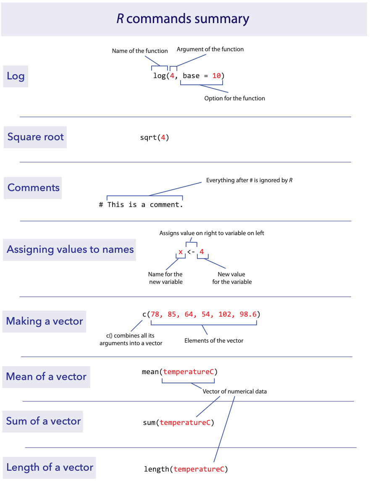

```{r setup, include=FALSE}
knitr::opts_chunk$set(echo = TRUE)
```

*This lab is part of a series designed for BIOL 300, based on* The
Analysis of Biological Data*. The rest of the labs can be found
[here](index.html).*

<br>

# Learning outcomes

-   Learning how to start with R and RStudio

-   Use functions in R

-   Write and save an R script

<br>

Data, R scripts, and other resources for these labs can be downloaded
from [here as a .zip file](ABDLabs.zip). Please open the ABDLabs folder
created by the .zip file in a location on your computer that you can
come back to use repeatedly.

------------------------------------------------------------------------

<br>

# Learning the tools

<br>

## What is R?

R is a computer program that allows an extraordinary range of
statistical calculations. It is a free program, mainly written by
voluntary contributions from statisticians around the world. R is
available on most operating systems, including Windows, Mac OS, and
Linux.

R can make graphics and do statistical calculations. It is also a
full-fledged computing language. In this series of labs, we will only
scratch the surface of what R can do.

<br>

## What is *RStudio*?

*RStudio* is a separate program, also free, that provides a more elegant
front end for R. RStudio allows you to easily organize separate windows
for R commands, graphic, help, etc. in one place.

If your computer does not already have a version of R and RStudio
installed, look at the [instructions for getting set
up](R_tutorial_Loading_R_and_RStudio.html).

<br>

## Getting started

If you haven't done so already, download the folder called
[ABDLabs](ABDLabs.zip). Inside this folder are all the data sets you
will need for these labs. Also, there is a file in that folder called
**`ABDLabs.Rproj`**. [Double-click on this file to start R and
RStudio.]{style="color:red"} If you start R from this file, it will
automatically load some packages that will add some useful
functionality, and it will tell R to look for files inside the `ABDLabs`
folder. Both of these will let you skip some steps later.

You can also start R and Rstudio directly from the RStudio application.
The icon for the application should look something like this:

<left> 
</left>

When you start RStudio, it will automatically start R as well. You run R
inside RStudio.

After you have started RStudio, you should see a new window with a menu
bar at the top and three main sections. One of the sections is called
the “Console” – this is where you type commands to give instructions to
R and typically where you see R’s answers to you.

Another important corner of this window can show a variety of
information. Most importantly to us, this is where graphics will appear,
under the tab marked “Plots”.

<br>

## The Console

When you start RStudio, you’ll see a corner of the window called the
“Console”. By the default the console window is in the bottom left of
the Rstudio screen.

You can type commands in this window where there is a prompt (which will
look like a `>` sign at the bottom of the window). The Console has to be
the selected window. (Clicking anywhere in the Console selects it.)

The `>` prompt is R’s way of inviting you to give it instructions. You
communicate with R by typing commands after the `>` prompt.

Type “**2 + 2**” at the `>` prompt, and hit return. You’ll see that R
can work like a calculator (among its many other powers). It will give
you the answer, 4, and it will label that answer with `[1]` to indicate
that it is the first element in the answer. (This is sort of annoying
when the answers are simple like this, but can be very valuable when the
answers become more complex.)

In these labs, the input will show up in a gray box and the output, if
any, will follow in a white box.

```{r}
2 + 2
```

<br>

### `log()`

You can use a wide variety of math functions to make calculations here,
e.g., `log()` calculates the log of a number:

```{r}
log(42)
```

(By default, this gives the natural log with base e.)

Parentheses are used both as a way to group elements of the calculation
and also as a way to denote the arguments of functions. (The “arguments”
of a function are the set of values given to it as input.) For example,
`log(3)` is applying the function `log()` to the argument `3`.

<br>

### `sqrt()`

Another mathematical function that often comes in handy is the square
root function, `sqrt()`. For example, the square root of 4 is:

```{r}
sqrt(4)
```

To calculate a value with an exponent, use the `^` symbol. For example
4^3^ is written as:

```{r}
4^3
```

Of course, many math functions can be combined to give an almost
infinite possibility of mathematical expressions. For example,

$$\frac{1}{\sqrt{2\pi (3.1)^2}}   e^{-\frac{(12-10.7)^2}{2(3.1) }}$$

can be calculated with

```{r}
(1 / (sqrt(2 * pi * (3.1)^2))) * exp(-(12-10.7)^2/(2*3.1))
```

<br>

## Writing and saving R scripts

You should keep a record of all commands used, along with copious notes,
so that weeks or years later you can retrace the steps of your earlier
analysis. An `.R` script provides a convenient way to do this.

In RStudio, you can create an `.R` script file which contains R commands
that can be reloaded and used at a later date. Under the menu at the
top, choose `File → New File → R Script`. This will create a new section
in RStudio with the temporary name “Untitled1” (or similar). You can
copy and paste any commands that you want from the Console, or type
directly here. (When you copy and paste, it’s better to not include the
`>` prompt in the script.)

To keep this script for later, just hit Save under the File menu. In the
future you can open this file to have those commands available for use
again.

It is best to type all your commands in the script window and run them
from there, rather than typing directly into the console. This lets you
save a record of your session so that you can more easily re-create what
you have done later.

<br>

## Comments

In scripts, it can be very useful to save a bit of text which is not to
be evaluated by R. You can leave a note to yourself (or a colleague)
about what the next line is supposed to do, what its strengths and
limitations are, or anything else you want to remember later. To leave a
note, we use “comments”, which are a line of text that starts with the
hash symbol `#`. Anything on a line after a `#` will be ignored by R.

```{r}
# This is a comment. Running this in R will 
# have no effect.

# You can also leave an in-line comment after a command:
9^0.5 # This is another way to take a square root

# Anything after the "#" will be treated as a comment, even if it has R code: 
# log(4)
```

<br>

## Functions

Most of the work in R is done by functions. A function has a name and
one or more arguments. For example, `log(4)` is a function that
calculates the log in base e for the value 4 given as input.

Sometimes functions have optional input arguments. For the function
`log()`, for example, we can specify the optional input argument `base`
to tell the function what base to use for the logarithm. If we don't
specify the base variable, it has a default value of `base = e`. To get
a log in base 10, for example, we would use:

```{r}
log(4, base = 10)
```

<br>

## Defining objects

In R, we can store information of various sorts by assigning them to
objects. For example, if we want to create a object called `x` and give
it a value of 4, we would write

```{r}
x <- 4
```

The middle bit of this: `<-`, a less than sign and a hyphen typed
together to make something that looks a little like a left-facing arrow,
tells R to assign the value on the right to the object on the left.
After running the command above, whenever we use `x` in a command it
would be replaced by its value 4. For example, if we add 3 to `x`, we
would expect to get 7.

```{r}
x + 3
```

Objects in R can store more than just simple numbers. They can store
lists of numbers, functions, graphics, etc., depending on what values
get assigned to the object.

We can always reassign a new value to a object. If we now tell R that
`x` is equal to 32:

```{r}
x <- 32
```

then `x` takes its new value:

```{r}
x
```

<br>

## Names

Naming objects and functions in R is pretty flexible.

A name has to start with a letter, but that can be followed by letters
or numbers. There can’t be any spaces, though.

Names in R are case-sensitive, which means that `Weights` and `weights`
are completely different things to R. This is a common and incredibly
frustrating source of errors in R.

It’s a good idea to have your names be as descriptive as possible, so
that you will know what you meant later on when looking at it. (However,
if they get too long, it becomes painful and error prone to type them
each time we use them, so this, as with all things, requires
moderation.)

Sometimes clear naming means that it is best to have multiple words in
the name, but we can't have spaces. Therefore a common approach is like
we saw in the previous section, to chain the words with underscores (not
hyphens!), as in `weights_before_hospital`. This convention is called
"snake_case".

Another solution to make separate words stand out in a object name is to
vary the case: `weightsBeforeHospital`. This convention is called
"camelCase".

<br>

## Vectors

One useful feature of R is the ability to sometimes apply functions to
an entire collection of numbers. The technical term for a set of numbers
is “vector”. For example, the following code will create a vector of
five numbers:

```{r}
c(78, 85, 64, 54, 102, 98.6)
```

<br>

### `c()`

`c()` is a function that creates a vector, containing the list of items
given in its arguments. To help you remember, you could think of the
function `c()` meaning to “combine” some elements into a vector.

Let’s add a little extra here to make the computer remember this vector.
Let’s assign it to a object, called `temperatureF` (because these
numbers are actually a set of temperatures in degrees Fahrenheit):

```{r}
temperatureF <- c(78, 85, 64, 54, 102, 98.6)
```

The combination of the less than sign and the hyphen makes an arrow
pointing from right to left—this tells R to assign the stuff on the
right to the name on the left. In this case we are assigning a vector to
the object `temperatureF`.

Inputting this to R causes no obvious output, but R will now remember
this vector of temperatures under the name `temperatureF`. We can view
the contents of the vector `temperatureF` by simply typing its name:

```{r}
temperatureF
```

The power of vectors is that sometimes R can do the same calculation on
all elements of a vector with one command. For example, to convert a
temperature in Fahrenheit to Celsius, we would want to subtract 32 and
multiply times 5/9. We can do that for all the numbers in this vector at
once:

```{r}
temperatureC <- (temperatureF - 32) * 5/9

temperatureC
```

To pull out one of the numbers in this vector, we add square brackets
after the vector name, and inside those brackets put the index of the
element we want. (The “index” is just a number giving the relative
location in the vector of the item we want. The first item has index 1,
etc.) For example, the second element of the vector `temperatureC` is

```{r}
temperatureC[2]
```

One of the common ways to slip up in R is to confuse the [square
brackets] which pull out an element of a vector, with the (parentheses)
, which is used to enclose the arguments of a function.

Vectors can also operate mathematically with other vectors. For example,
imagine you have a vector of the body weights of patients before
entering hospital (`weight_before_hospital`) and another vector with the
same patient’s weights after leaving hospital (`weight_after_hospital`).
You can calculate the change in weight for all these patients in one
command, using vector subtraction:

```{r eval=FALSE}
weight_change_during_hospital <- weight_after_hospital - weight_before_hospital
```

The result will be a vector that has each patient’s change in weight.

<br>

## Basic calculation examples

In this course, we’ll learn how to use a few dozen functions, but let’s
start with a couple of basic ones.

<br>

### `mean()`

The function `mean()` does just what it sounds like: it calculates the
sample mean (that is, the average) of the vector given to it as input.
For example, the mean of the vector of the temperatures in degrees
Celsius from above is 26.81481:

```{r}
mean(temperatureC)
```

<br>

### `sum()`

Another simple (and simply named) function calculates the sum of all
numbers in a vector: `sum()`.

```{r}
sum(temperatureC)
```

<br>

### `length()`

To count the number of elements in a vector, use `length()`.

```{r}
length(temperatureC)
```

This shows that there are 6 temperature values in the vector that make
up the vector `temperatureC`.

<br>

# R commands summary



------------------------------------------------------------------------

<br>

# Activities & Questions

<br> 1. Using the [Student data sheet
1](Student%20data%20sheet%201.pdf), record the requested information
about yourself. This is optional; if you have any reason to not want to
record this (relatively innocuous) data about yourself, you do not have
to. If you feel that you would like to skip just one of the bits of
information and fill in the rest, that is fine too. The data sheets do
not identify students by name. Pass the sheet to the TA when you are
finished. We’ll use these data in subsequent labs.

<br> 2. For each week, create an R script that captures the commands
that you use to answer the questions. Use a `#` at the beginning of each
comment line.

a.  Open a new R script file. Start by adding comments with your name
    and the week (Week 1) at the top.

b.  For each of the questions below, write the question number as a
    comment, followed by any R code you use to do the question, and give
    the answers as comments.

For example, here is what part of your script might look like.

```{r eval=FALSE}
# R Labs, Week 1
# Terry T. Student

# Question 4a
15*17
# [1] 255
```

<br> 3. All of the commands used in the “Learning the Tools” section for
this lab are in a script called `LearningToolsWeek1.R` in the [ABDLabs
folder](ABDLabs.zip) that you should have downloaded. (A similar file
will be available for each week of these labs.)

a.  Load this script into RStudio.

b.  Run most or all of the commands in R. Did you get the same answers
    as shown in the text?

<br> 4. For each of the following, come up with a object name that would
be appropriate to use in R for the listed variable:

a.  Body temperature in Celsius

b.  How much aspirin is given per dose for a patient

c.  Number of televisions per person

d.  Height (including neck and extended legs) of giraffes

<br> 5. Use R to calculate:

a.  15 x 17

b.  13^3^

c.  log(14) (use the natural log)

d.  log(100) (use base 10)

e.  $\sqrt{81}$.

<br> 6. People are notoriously dishonest about revealing how often they
perform antisocial behaviors like peeing in swimming pools. (In addition
to being disgusting, the nitrogenous chemicals in urine combine with the
pool’s chlorine to produce some toxic chemicals like trichloramine, the
source of most skin irritations for swimmers.) A group of researchers
(Jmaiff Blackstock et al. 2017) recently realized that an artificial
sweetener called ACE passes out in urine unmetabolized and in known
average quantities, and therefore by measuring ACE concentrations we can
measure the amount of urine in a pool.

Here is a list of measurements, each from a different pool, of the
concentration of ACE (measured in ng/L) for 23 different pools in
Canada.

```         
640, 1070, 780, 70, 160, 130, 60, 50, 2110, 70, 350, 30, 210, 90, 470, 580, 250, 310, 460, 430, 140, 1070, 130
```

a.  In R, create a vector of these data, and name it appropriately.

b.  What is the mean ACE concentration of these 23 pools?

c.  Urine on average has 4000 ng ACE/ ml. Therefore to convert these
    measurements of ng ACE / L pool water to ml urine / L pool water we
    need to divide each by 4000. Make a new vector showing the
    concentration of urine per liter in these 23 pools. Give it a
    suitable name.

d.  What is the mean concentration of urine per liter? How did this
    change relative to the mean measurement of ng ACE / L ?

e.  The arithmetic mean is calculated by adding up all the numbers and
    dividing by how many numbers there are. Calculate the mean of these
    numbers using `sum()` and `length()`. Did you get the same answer as
    with using `mean()`?

f.  Use R to calculate the average amount of urine (in ml) in a 500,000
    L pool.

<br>

{width="480"}

<br> 7. Weddell seals live in Antarctic waters and take long strenuous
dives in order to find fish to feed upon. Researchers (Williams et al.
2004) wanted to know whether these feeding dives were more energetically
expensive than regular dives (perhaps because they are deeper, or the
seal has to swim further or faster). They measured the metabolic costs
of dives using the oxygen consumption of 10 animals (in ml O~2~ / kg)
during a feeding dive. (Photo above by Giuseppe Zibordi, NOAA Photo
Library)

Here are the data:

```         
71.0, 77.3, 82.6, 96.1, 106.6, 112.8, 121.2, 126.4, 127.5, 143.1
```

For the same 10 animals, they also measured the oxygen consumption in
non-feeding dives. With the 10 animals in the same order as before, here
are those data:

```         
42.2, 51.7, 59.8, 66.5, 81.9, 82.0, 81.3, 81.3, 96.0, 104.1
```

a.  Make a vector for each of these lists, and give them appropriate
    names.

b.  Confirm (using R) that both of your vectors have the same number of
    individuals in them.

c.  Create a vector called `MetabolismDifference` by calculating the
    difference in oxygen consumption between feeding dives and
    nonfeeding dives for each animal.

d.  What is the average difference between feeding dives and nonfeeding
    dives in oxygen consumption?

e.  Another appropriate way to represent the relationship between these
    two numbers would be to take the ratio of O~2~ consumption for
    feeding dives over the O~2~ consumption of nonfeeding dives. Make a
    vector which gives this ratio for each seal.

f.  Sometimes ratios are easier to analyze when we look at the log of
    the ratio. Create a vector which gives the log of the ratios from
    the previous step. (Use the natural log.) What is the mean of this
    log-ratio?
