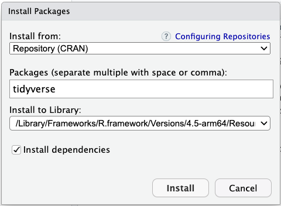
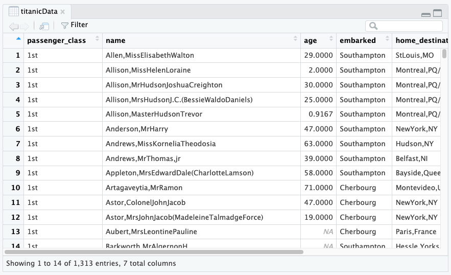
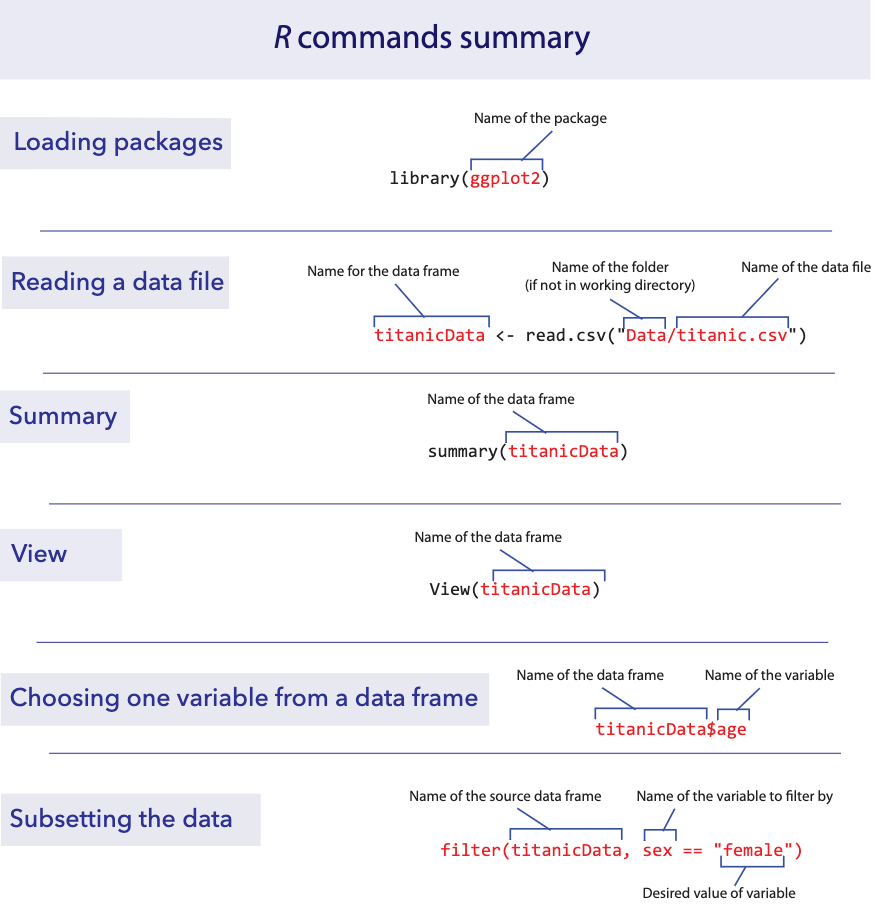

```{r setup, include=FALSE}
knitr::opts_chunk$set(echo = TRUE)
```

*This lab is part of a series designed for BIOL 300, based on* The
Analysis of Biological Data*. The rest of the labs can be found
[here](index.html).*

<br>

# Learning outcomes

-   Make data files for R

-   Use data frames and tibbles

-   Learn how to increase the power of R with packages

<br>

Data, R scripts, and other resources for these labs can be downloaded
from [here as a .zip file](ABDLabs.zip). Please open the `ABDLabs`
folder created by the `.zip` file in a location on your computer that
you can come back to use repeatedly.

------------------------------------------------------------------------

<br>

# Learning the tools

<br>

## Structure of a good data file

Data files appear in many formats, and different formats are sometimes
preferable for different tasks. However, there is one especially useful
way to organize data for statistics and R, called "tabular data".

The tabular format is actually very simple. Each row in the data set
represents an individual or observational unit, and each column
represents a variable measured on those individuals.

For example, here is a small data set about the tongue and palate
lengths of several species of bats. In this data set, each row is one
species of bat, and the columns contain the species name, palate length,
and tongue length.

| species                 | palate_length | tongue_length |
|-------------------------|---------------|---------------|
| Lichonycteris obscura   | 10            | 36.1          |
| Glossophaga comissarisi | 10.7          | 26.6          |
| Glossophaga soricina    | 11.4          | 30.2          |
| Anoura caudifer         | 11.6          | 36.7          |
| Hylonycteris underwoodi | 13.4          | 36.7          |
| Anoura geoffroyi        | 13.8          | 39.6          |
| Lonchophylla robusta    | 14.3          | 42.6          |
| Anoura fistulata        | 12.4          | 85.2          |
| Anoura cultrata         | 14.3          | 34.3          |
| Leptonycteris curosoae  | 16            | 40.2          |
| Choeronycteris mexicana | 18            | 52.1          |

<br>

### Recording metadata

Data have no value unless they can be correctly interpreted. It is
important to record enough information that each variable in your data
set can be well-understood by another reader (including your future
self).

Key information includes the meaning of each variable name, including
units, along with when, where and who collected the data. The objective
here is to provide a short document that another person could read to
unambiguously interpret your data file.

<br>

## Creating a data file

When you have new data that you want to get into the computer in a
format that R can read, it is often easiest to do this outside of R. A
spreadsheet program like Excel (or a free alternative like Google
Sheets) gives a straightforward way to create a comma-separated values
file, or `.csv`, that R can read.

In your spreadsheet program, create a new blank workbook. In the first
row of your new spreadsheet, write your variable names, one for each
column. (Be sure to give them good names that will work in R. Mainly,
don't have any spaces in a variable name and make sure that it doesn't
start with a number or contain punctuation marks. See Lab 1 for more
about naming variables.)

On the rows immediately below that first row, enter the data for each
individual, in the correct column. Here’s what the spreadsheet would
look like for the bat data after they are entered:


<br>

## Saving as a .csv file

Saving a spreadsheet in a format that R can read is very
straightforward. In these labs, we are using `.csv` files. Once you have
made your spreadsheet, choose `File → Save as…`. This will open a dialog
box. First, give the file a name with the extension `.csv` at the end.
We used “BatTongues.csv”.

Second, choose the folder in which you want to save the file. For any
data files we create for BIOL 300, save them in the `DataForLabs` folder
(`DataForLabs` should be within your `ABDLabs` folder).

Third, select the correct format for the file: “Comma separated values
(.csv)”, which you can find in the dropdown next to `Format:` in the
dialog box. It might look something like this:


In the resulting file, the first line will be a header that lists the
names of each column (variable). After that there will be one line for
each individual. All the variable names in the first row and the
variable values in the later rows will be separated by commas, hence the
name of the format.

If you followed what we did for all 3 steps, the relative file path for
the bat data would be something like this:
`ABDLabs/DataForLabs/BatTongues.csv`. If you opened the `.csv` file in a
text editor, it would look like this:

------------------------------------------------------------------------

species,palate_length,tongue_length <br> Lichonycteris obscura,10,36.1
<br> Glossophaga comissarisi,10.7,26.6 <br> Glossophaga
soricina,11.4,30.2 <br> Anoura caudifer,11.6,36.7 <br> Hylonycteris
underwoodi,13.4,36.7 <br> Anoura geoffroyi,13.8,39.6 <br> Lonchophylla
robusta,14.3,42.6 <br> Anoura fistulata,12.4,85.2 <br> Anoura
cultrata,14.3,34.3 <br> Leptonycteris curosoae,16,40.2 <br>
Choeronycteris mexicana,18,52.1 <br>

------------------------------------------------------------------------

All the information is there, and it is stored in a simple text file
that can be read again by Excel or R or many other programs. We strongly
recommend against hand-editing a `.csv` file in a text editor, because
it is very easy to mess up the formatting and make the file unreadable
by R. If you need to edit a `.csv` file, we recommend that you open it
in Excel or Google Sheets, make your edits, and then save it again as a
`.csv` file.

------------------------------------------------------------------------

<br>

## Installing packages

R has a lot of power in its basic form, but one of the most important
parts about R is that it is expandable by the work of other people.
These expansions are usually released in “packages”.

Each package needs to be installed on your computer only once, but to be
used it has to be loaded into R during each session.

To install a package in RStudio, click on the Packages tab from the
sub-window with tables for Files, Plots, Packages, Help, and Viewer.
Immediately below that will be a button labeled “Install”—click that and
a window will open.

{width="300"}

In the second row (labeled “Packages”), type `tidyverse` (without
quotation marks). Make sure the box for “Install dependencies” near the
bottom is clicked, and then click the “Install” button at bottom right.

{width="350"}

Installing an R package only needs to be done once on a given computer.
If installed correctly, the package wil permanently available from that
point forward (though it will need to be loaded).

<br>

## Loading a package

Once a package is installed, it needs to be loaded into R during a
session if you want to use it. You do this with a function called
`library()`.

<br>

### `library()`

For this lab, we will use functions from a couple packages within the
tidyverse. Before using the functions in these packages, we need to load
tidyverse. We do this with the `library()` function. In the console,
enter this:

```{r}
library(tidyverse)
```

If the `tidyverse` was is installed on your computer correctly, the
computer will show a brief status message and then will be ready to go.
If the package is not installed, it will give you an error message in
red asking you to install the package.

<br>

## Setting the working directory

The files on your computers are organized hierarchically into folders,
or “directories”. It is convenient in RStudio to tell R which directory
to look for files at the beginning of a session, to minimize typing
later.

For these labs, the best way to set your working directory is to start R
and Rstudio by clicking on the `ABDLabs.Rproj` file in the `ABDLabs`
directory. This will automatically load the needed packages and set the
working directory to this folder.

You can also manually set the working directory from RStudio’s menu via
`Session → Set Working Directory → Choose Directory…`. This will open a
dialog box that will let you find and select the directory you want. For
BIOL 300 labs, use `ABDLabs` as your working directory.

<br>

## Reading a file

In these labs, we have saved the data in a comma-separated variable
(CSV) format. All files in this format ought to have `.csv` as the end
of their file name. A CSV file is a plain text file, easily read by a
wide variety of programs. Each row in the file (besides the first row)
is the data for a given individual, and for each individual each
variable is listed in the same order, separated by commas. It’s
important to note that you can’t have commas elsewhere in the file; they
function as the separators.

The first row of a CSV file should be a “header” row, which gives the
names of each variable, again separated by commas.

<br>

### `read.csv()`

For examples in this lab, let’s use a data set about the passengers of
the RMS Titanic. One of the data sets in the folder of data attached to
this lab is called `titanic.csv`. This is a data set of 1313 passengers
from the voyage of this ship, which contains information about some
personal info about each passenger as well as whether they survived the
accident or not.

To import a CSV file into R, use the `read.csv()` function as in the
following command. (This assumes that you have set the working directory
to `ABDLabs`, as we described above.)

```{r}
titanicData <- read.csv("DataForLabs/titanic.csv", stringsAsFactors = TRUE)
```

This looks for the file called `titanic.csv` in the folder called
`DataForLabs.` Here we have given the name `titanicData` to the object
in R that contains all this passenger data. Of course, if you wanted to
load a different data set, you would be better off giving it a more apt
name than “titanicData”. The option `stringsAsFactors = TRUE` asks R to
interpret the columns with non-numerical information as “factor” with
possibly repeated instances of the same value of a categorical variable.

R has other functions that can read other data formats besides csv
files, but the function `read.csv()` requires that the file be a csv
file.

### Finding files in other locations

For all of the examples in BIOL 300 labs, we assume that the data is in
a folder called `DataForLabs` and that folder resides in the `ABDLabs`
folder. When you work on a new data set outside of these labs, you will
want to store the data somewhere else. To import data into R from
another location on your computer, you need to know the full file path
for the file. For example, the file path to the titanic file on my Mac
is "/Users/whitlock/Desktop/ABDLabs/DataForLabs/titanic.csv". On a
Windows machine, it would look something like
"C:\\Documents\\ABDLabs\\DataForLabs\\titanic.csv". In either case, this
file path describes a series of folders nested inside one another that
tells the computer where to look for the file.

By supplying the full address, you are telling `read.csv()` to look for
the file outside your current working directory. Reading a file from any
location can be done with `read.csv()` like this:

```{r eval=FALSE}
titanicData <- read.csv("/Users/whitlock/Desktop/ABDLabs/DataForLabs/titanic.csv", stringsAsFactors = TRUE)
```

<br>

## A first look at data

To see if the data were imported appropriately and/or get a sense of the
characteristics of the data, the `summary()` and `View()` commands can
be useful.

### `summary()`

This function will list all the variables and some summary statistics
for each variable.

```{r}
summary(titanicData)
```

### `View()`

The `View()` function is a nice way to see the data in a
spreadsheet-like format. To see the data in `titanicData` with `View()`,
run the following command:

```{r eval=FALSE}
View(titanicData)
```

{width="700"}

Again, note that the `titanicData` object has 7 columns and 1313 rows.
The horizontal and vertical scroll bars will allow you to see more of
the data compared to what may initially appear in the window.

<br>

## Data frames and tibbles

In R, a data set is often stored as a `data.frame` or a `tibble`. For
now, you can think of these as very similar: both store data in rows and
columns (tabular data).

Each column contains one variable, such as age, sex, or survival. Each
row contains one individual, such as one passenger on the Titanic. The
values in a row belong together, so the first value in each column
describes the same individual, the second value in each column describes
the next individual, and so on.

The function `read.csv()` loads data into R as a `data.frame`. The data
set is usually given a name, which lets us tell R which data set to use.
For example, in the previous section we read in a data set and called it
`titanicData`. This object contains information about passengers on the
Titanic. It has seven variables, so it has seven columns:
`passenger_class`, `name`, `age`, `embarked`, `home_destination`, `sex`,
and `survive`.

<br>

### Columns within data frames

Very importantly, we can grab one column from a data frame or tibble by
itself. We write the name of the data set, followed by a `$`, and then
the name of the variable.

For example, to show a list of the age of all the passengers on the
Titanic, use

```{r eval=FALSE}
titanicData$age
```

This will show a vector that has all the values for this variable age,
one for each individual in the data set.

<br>

## Adding a new column

Sometimes we would like to add a new column to a data frame. The easiest
way to do this is to simply assign a new vector to a new column name,
using the `$`.

For example, to add the log of age as a column in the `titanicData` data
frame, we can write

```{r}
titanicData$log_age <- log(titanicData$age)
```

You can run the command `head(titanicData)` to see that `log_age` is now
a column in `titanicData`.

```{r}
head(titanicData)
```

The `head()` function shows the first 6 rows of a data frame or tibble,
which is a handy way to check that you understand the structure of the
data and/or that you have added the new column correctly.

<br>

## Subsetting with `filter()`

Sometimes we want to do an analysis only on some of the data that fit
certain criteria. For example, we might want to analyze the data from
the Titanic using only the information from females.

The easiest way to do this is to use the `filter()` function from the
package `dplyr`. `dplyr` is a package within the tidyverse, so make sure
you have loaded tidyverse into R using `library()`. `libary(tidyverse)`
only needs to be run once per session, and then you can use any of the
functions in the tidyverse packages, including `filter()`.

In the titanic data set there is a variable named `sex`, and an
individual is female if that variable has value `female`. We can create
a new data frame that includes only the data from females with the
following command:

```{r}
titanicDataFemalesOnly <- filter(titanicData, sex == "female")
```

This new data frame will include all the same columns as the original
`titanicData`, but it will only include the rows for which the sex was
`female`.

Note that the syntax here requires a double equal sign: `==`. In R (and
many other computer languages), the double equal sign creates a
statement that can be evaluated as `TRUE` or `FALSE`, whereas a single
equal sign may change the value of the object to the value on the
right-hand side of the equal sign. Here we are asking, for each
individual, whether `sex` is `female`. We not assigning the value
`female` to the variable `sex`. So we must use a double equal sign `==`.

<br>

# R commands summary



------------------------------------------------------------------------

<br>

# Activities & Questions

<br> 1. Install the `tidyverse` package on your system if you haven't
already. After it has installed, use `library(tidyverse)` to load it
into your R environment.

<br> 2. In Lab 1, Question 7, you and your fellow students may have
recorded requested information about yourselves. Your TA will now
provide you with data sheets for all students in your section who took
measurements (all data are anonymous). Use the data sheets to create a
`.csv` file in Excel or Google Sheets. Include all of five of the
variables for each of the individuals in the data sheets. Be sure to use
variable names that are 1) legal in R and 2) intelligible to another
person who may encounter the file. Save the data file that you make in
the `DataForLabs` folder on your computer with the file name
`CollectedDataFromLab1.csv`.

a.  Prepare a text file which describes each of the variables in the
    data file. Remember to list the meaning of each variable name,
    including units. The objective here is to provide a short document
    that another person could read to unambiguously interpret your data
    file.

b.  Import this data file into R using `read.csv()`, and give the
    resulting data frame a name that makes sense to you.

c.  Use the `View()` function to check that you have read the data
    correctly.

d.  Use the `summary()` function to determine the proportion of people
    in your tutorial section who are right-handed.

<br> 3. The data file called `countries.csv` in the `DataForLabs` folder
contains information about all the countries on Earth. Each row is a
country, and each column contains a variable.

a.  Use `read.csv()` to read the data from this file into a data frame
    called countries.

b.  Use `summary()` to get a quick description of this data set. What
    are the first three variables?

c.  Using the output of `summary()`, how many countries are from Africa
    in this data set?

d.  What kinds of variables (i.e., categorical or numerical) are
    `continents`, `cell_phone_subscriptions_per_100_people_2012`,
    `total_population_in_thousands_2015` and
    `fines_for_tobacco_advertising_2014`? (Don't go by their variable
    names – look at the data in the summary results to decide.)

e.  Add a new column to your countries data frame that has the
    difference in ecological footprint between 2012 and 2000. What is
    the mean of this difference? (Note: this variable will have “missing
    data”, which means that some of the countries do not have data in
    this file for one or the other of the years of ecological footprint.
    By default, R doesn’t calculate a mean unless all the data are
    present. To tell R to ignore the missing data, add an option to the
    `mean()` command that says `na.rm=TRUE`. We’ll learn more about this
    later.)

<br> 4. Using the `countries` data again, create a new data frame called
`AfricaData` via the `filter()` function, that only includes data for
countries in Africa. What is the sum of the
`total_population_in_thousands_2015` for this new data frame?
