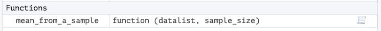

```{r setup, include=FALSE}
knitr::opts_chunk$set(echo = TRUE)
```

<br>

<p style="color:red">

*Unlike the rest of these labs, this lab depends on having some physical
objects prepared in a class setting ahead of time and requires a class
of 12 or more to work properly.*

</p>

*This lab is part of a series designed for BIOL 300, based on* The
Analysis of Biological Data*. The rest of the labs can be found
[here](index.html).*

<br>

# Learning outcomes

- Explore the importance of random sampling

- Understand the sampling distribution of an estimate

- Investigate sampling error and sampling bias

- Practice creating data files.

<br>

If you have not already done so, download [the zip file containing Data,
R scripts, and other resources for these labs](ABDLabs.zip). Remember to
start RStudio from the `ABDLabs.Rproj` file in that folder to make these
exercises work more seamlessly.

------------------------------------------------------------------------

<br>

# Activities & Questions

<br>

In this lab you will be given a container of 25 cowrie shells. Think of
this collection of shells as the complete population that you care
about. You will work with a small group to take samples from this
population to estimate the mean length of these shells.

Make a script in RStudio that includes all your R code to answer the
questions. Include answers to all questions using comments. <br>

Follow these steps:

<br>

## Make a sample

1.  Get a piece of calendar paper, and make sure that there are spots
    labeled from 1 to 25 on squares of the calendar paper.

2.  Sample five shells from this container. Put them in spots 1 through
    5 on the paper. This is your sample.

3.  For each shell that you have sampled, measure the length of the
    shell in millimeters, and write these lengths down on the paper by
    that shell.

4.  Create a new spreadsheet in Excel or Google Sheets, and on the first
    row add a variable name (e.g., “length”). Enter the lengths of your
    five shells. Save the file as `Lab3_First_sample.csv` in your
    `DataForLabs` folder.

5.  In your R script for today's lab, import `Lab3_First_sample.csv`
    into R. Using R, calculate the mean of the lengths of these five
    shells. Record this mean. <br>

## Find the mean of the population

6.  Next we will calculate the mean of the population of shells in your
    container. Take each remaining shell one by one, measure its length,
    and record it on the sheet beside the next available number. Set the
    shell there on the calendar paper as well.

7.  Create another blank spreadsheet in Excel or Google Sheets. Add the
    lengths of all the shells (including the first five) into this file
    in a single column named “length.” Save this file as
    `Lab3_Full_population_shells.csv`.

8.  Import this data set to R, naming the object `population_data`. Use
    R to calculate the mean of the full population.

9.  Give your TA the mean of your first sample and the mean of your
    population, for later full class use.

**Question 1.** Is the mean of your sample the same as the mean of the
population as a whole? What about the standard deviation? Suggest
reasons why the sample mean and the population mean might differ.

<br>

## Make a random sample and estimate the population mean

10. In step 1, we made a sample, but it was not necessarily a random
    sample. Let’s now randomly sample from the population. You should
    have each shell next to a unique number on your sheet. To take a
    random sample, all members of the population must have the same
    chance of being chosen for our sample. In R, the function
    `sample.int()` randomly chooses integers from a given range. To
    randomly sample 5 individuals from 25 possibilities, we can use:

```{r}
sample.int(n = 25, size = 5)
```

This tells R to give us a sample of `size = 5` numbers randomly chosen
from the integers 1 to `n`, and here we set `n = 25`. (When you run this
line you will almost certainly get a different output. It is randomly
choosing numbers, so we expect different answers each time.) Generate a
set of 5 random numbers this way, just once. Use these resulting numbers
to tell you which 5 shells to include in your sample.

11. Use R to calculate the mean of the shell lengths for these 5 shells
    in your random sample. The result is an estimate of the mean shell
    length in your population.

12. Make another random sample of 5 shells, and calculate the mean of
    this sample. Did you get a different number from the mean of the
    first sample? Why do you think the second sample mean might be
    different from the first?

<br>

## Making a distribution of sample means

The estimates you obtained from your random samples in steps 10 and 12
are just two of many values that you might have obtained. By chance,
each sample is likely to be different from other samples, with a
different sample mean. The frequency distribution of estimates that you
might obtain when sampling randomly from a population, and their
probabilities of occurrence, is called the sampling distribution of the
estimate. To explore the sampling distribution for the sample mean,
let’s randomly sample from your population of shells several times. Each
sample is going to have five shells, and we’ll calculate the mean of
each sample.

In real life situations, you won’t have the whole population to work
with, and you won’t be able to take many random samples. As a result,
you won’t be able to glimpse the sampling distribution. But in this
artificial scenario we can create multiple samples from our population
to see what the sampling distribution might look like.

13. Taking each sample by hand is tedious. To speed up this process, we
    have written a short R function to sample from your list of shell
    lengths in your population. This will have the computer do the steps
    that you did in the previous steps.

The function is called `mean_from_a_sample()`, and it is written below.
Paste this full command into the R console and hit return. Make sure you
copy the whole function, including the closing curly bracket }. The
comment on each line within the function will give you a step-by-step
understaning of how it works.

```{r}
mean_from_a_sample <- function(datalist,sample_size) {
  population_size = length(datalist)  # Establish the size of the "population"
  sample_numbers = sample.int(population_size,sample_size)  # chooses which individuals to sample
  sample_values = datalist[sample_numbers]  # Looks up the values for those individuals in the data
  sample_mean = mean(sample_values,na.rm=TRUE)   # Calculates the mean of those sampled individuals
  sample_mean
}
```

If done correctly, you should see `mean_from_a_sample` in your
Environment:

{width="640"}

Call this function by entering:

```{r eval=FALSE}
> mean_from_a_sample(population_data$length, sample_size  = 5)
```

where `population_data` is the list of all the lengths of the shells
from your population and 5 is the sample size. Running this will give
you the mean length of a random sample of 5 shells.

14. To make a vector with the means of 1000 random samples of the shell
    lengths, run the following:

```{r eval = FALSE}
sample_mean_length = rep(0,1000)
for(i in 1:1000) sample_mean_length[i] = 
      mean_from_a_sample(population_data$length,5)
```

This creates a vector called `sample_mean_length` and fills it with 1000
means of independent random samples.

15. Plot a histogram that shows the distribution of the means of these
    random samples. You can do this using the `hist()` function. Note
    that next week, we will learn how to use `ggplot()` to make figures
    that are more elegant and customizable.

```{r eval = FALSE}
hist(sample_mean_length)
```

**Question 2.** Describe the shape of this distribution. Does it
resemble a normal distribution? Does every sample return the same value
of the mean? Why, or why not?

16. Calculate the mean of the distribution of sample means.

**Question 3.** How does the mean of the distribution of sample means
compare to the true mean of the population? Are they approximately
equal? Are the sample means unbiased estimates of the population mean?

<br>

## Sampling bias

17. Compare the mean of your first sample to the distribution of sample
    means obtained from the random samples. Is your first sample mean
    unusual in any way?

18. From your TA, get the list of the means from the first samples of
    each group, and the population means for each group. Import these
    data into a `data.frame` in R.

19. Create a new variable from the difference between a student group’s
    first sample mean and their population mean. Call this new variable
    `first_sample_error`. What is the average error of these first
    samples?

**Question 4.** Remember that these first samples were not necessarily
random samples, unlike the other samples that we made today. Is there
any pattern to the first samples that you think might result from this
lack of randomness? If so, why might this have happened?
