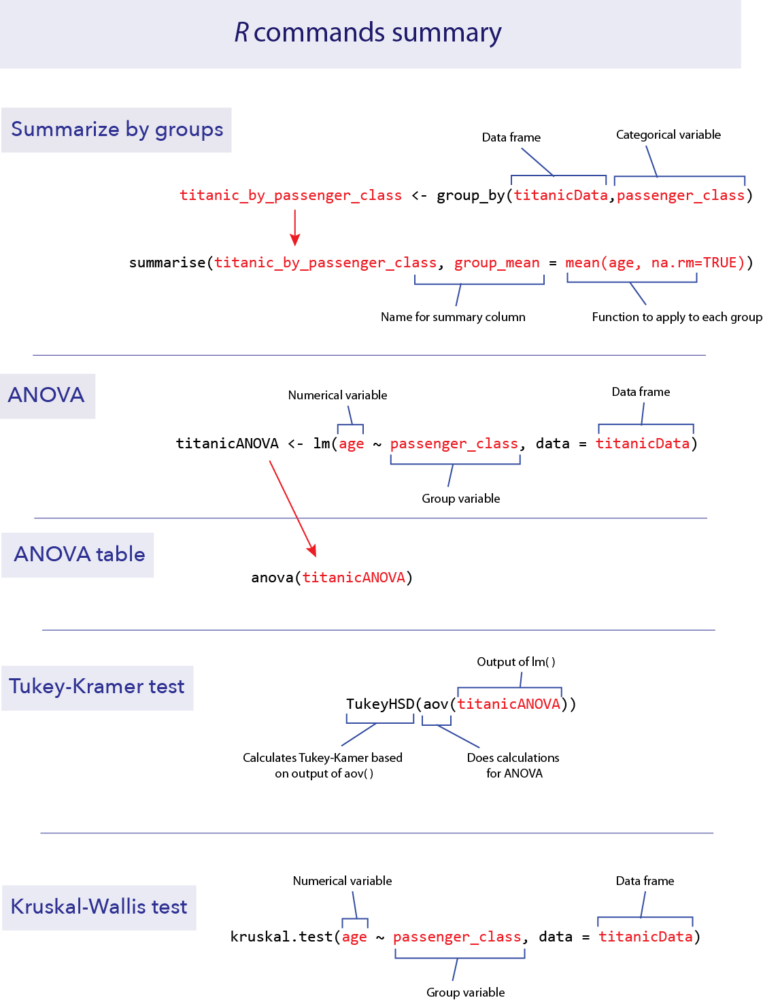

```{r setup, include=FALSE}
knitr::opts_chunk$set(echo = TRUE)
```


*This lab is part of a series designed to accompany a course using *The Analysis of Biological Data*. The rest of the labs can be found [here](index.html). This lab is based on topics in Chapter 15 of ABD.*


<br>

# Learning outcomes

*	Use R to perform analysis of variance (ANOVA) to compare the means of multiple groups.

*	Perform Tukey-Kramer tests to look at unplanned contrasts between all pairs of groups.

*	Use Kruskal-Wallis tests to test for difference between groups without assumptions of normality.

<br> 

If you have not already done so, download [the zip file containing Data, R scripts, and other resources for these labs](ABDLabs.zip). Remember to start RStudio from the "ABDLabs.Rproj" file in that folder to make these exercises work more seamlessly.


***
<br>

# Learning the tools


For the examples in this lab, we will again return to the Titanic data set. We’ll group passengers by the passenger class they travelled under (a categorical variable) and ask whether different passenger classes differed in their mean age (a numerical variable). 

First, load the data.

```{r}
titanicData <- read.csv("DataForLabs/titanic.csv", stringsAsFactors = TRUE)
```

Let’s first look at the data to get a sense of how well it fits the assumptions of ANOVA. Multiple histogram are useful for this purpose. As we saw in the last lab, we can use **ggplot()** and facets to make this plot:

```{r}
library(ggplot2)

ggplot(titanicData, aes(x = age)) +   
  geom_histogram() + 
  facet_wrap(~ passenger_class, ncol = 1) 
```


These data look sufficiently normal and with similar spreads that ANOVA would be appropriate.

To confirm these visual impressions, it would be useful to construct a table of the means and standard deviations of each group. There are numerous ways to do this in R, but one of the neatest is to use functions from the package **dplyr**. If you have not done so yet, install the **dplyr** package from the “Packages” tab in RStudio. Then load the **dplyr** package with **library()**.

```{r}
library(dplyr)
```


<br>

### group_by()

The package **dplyr** has several useful features for manipulating data sets. For our current purposes, we will find two functions particularly useful: **group_by()** and **summarise()**. These two functions are well named and work together well, first to organize the data by groups, and second to summarize the results for each group. 

First, use **group_by()** to organize your data frame by the appropriate grouping variable. For example, here we want to organize the **titanicData** by **passenger_class**:

```{r}
titanic_by_passenger_class <- group_by(titanicData,passenger_class)
```


<br>

### summarise()

After applying **group_by()** to a data frame, we can summarize the data using **summarise()**. (The “s” in **summarise()** is not a typo—the creator of the package is from New Zealand.)  With **summarise()**, we can apply any type of function that summarizes data (e.g. **mean()**, **median()**, **var()**, etc.), and receive that summary group by group. For example, to calculate the mean age of each **passenger_class**, we can use:

```{r}
summarise(titanic_by_passenger_class, group_mean = mean(age, na.rm=TRUE))
```

As input, we give the name of the grouped table created by **group_by()** and the function we want to apply to each group. In this case we used **mean(age, na.rm=TRUE)**. “**group_mean**” is a name we give to that summary variable (it could have been any name we wanted). The output looks like a table and includes the names of the groups being summarized. (A “tibble” is not how New Zealanders spell “table”, but is a type of table like a data frame.) “3 x 2” here refers to the number of rows x columns in the “tibble” output.

We can give **summarise()** many summary functions at once, and it will create columns in the output table for each one. For example, if we want to output both the mean and the standard deviation, we can add **sd = sd(age, na.rm=TRUE)** to the function above. 

```{r}
summarise(titanic_by_passenger_class, group_mean = mean(age, na.rm=TRUE), group_sd = sd(age, na.rm=TRUE))
```

Note that the standard deviations are very similar, which means that these data fit the equal variance assumption of ANOVA.


<br>

## ANOVA

Analysis of variance (or ANOVA) is not quite as simple in R as one might hope. Doing ANOVA takes at least two steps. First, we fit the ANOVA model to the data using the function **lm()**. This step carries out a bunch of intermediate calculations. Second, we use the results of first step to do the ANOVA calculations and place them in an ANOVA table using the function **anova()**. The function name **lm()** stands for “linear model”; this is actually a very powerful function that allows a variety of calculations. One-way ANOVA is a type of linear model. 


<br>

### lm()

The function **lm()** needs a formula and a data frame as arguments. The formula is a statement specifying the “model” that we are asking R to fit to the data. A model formula always takes the form of a response variable, followed by a tilde(**~**), and then at least one explanatory variable. In the case of a one-way ANOVA, this model statement will take the form 

```{r eval=FALSE}
numerical_variable ~ categorical_variable
```

For example, to compare differences in mean age among passenger classes on the Titanic, this formula is

```{r eval= FALSE}
age ~ passenger_class
```

This formula tells R to “fit” a model in which the ages of passengers are grouped by the variable **passenger_class**. 

The name of the data frame containing the variables stated in the formula is the second argument of **lm()**. Finally, to complete the **lm()** command, it is necessary to save the intermediate results by assigning them to a new object, which **anova()** can then use to make the ANOVA table. For example, here we assign the results of **lm()** to a new object named “**titanicANOVA**”:

```{r}
titanicANOVA <- lm(age ~ passenger_class, data = titanicData)
```


<br>

### anova()

The function **anova()** takes the results of **lm()** as input and returns an ANOVA table as output:

```{r}
anova(titanicANOVA)
```

This table shows the results of a test of the null hypothesis that the mean ages are the same among the three groups. The *P*-value is very small, and so we reject the null hypothesis of no differences in mean age among the passenger classes.


<br>

## Tukey-Kramer test

A single-factor ANOVA can tell us that at least one group has a different mean from another group, but it does not inform us which group means are different from which other group means. A Tukey-Kramer test lets us test the null hypothesis of no difference between the population means for all pairs of groups. The Tukey-Kramer test (also known as a Tukey Honest Significance Test, or Tukey HSD), is implemented in R in the function **TukeyHSD()**. 

We will use the results of an ANOVA done with **lm()** as above, that we stored in the variable **titanicANOVA**. To do a Tukey-Kramer test on these data, we need to first apply the function **aov()** to **titanicANOVA**, and then we need to apply the function **TukeyHSD** to the result. We can do this in a single command:

```{r}
TukeyHSD(aov(titanicANOVA))
```

The key part of this output is the table at the bottom. It estimates the difference between the means of groups (for example, the 2nd passenger class compared to the 1st passenger class) and calculates a 95% confidence interval for the difference between the corresponding population means. (“**lwr**” and “**upr**” correspond to the lower and upper bounds of that confidence interval for the difference in means.) Finally, it give the *P*-value from a test of the null hypothesis of no difference between the means (the column headed with “**p adj**”). In the case of the Titanic data, *P* is less than 0.05 in all pairs, and we therefore reject every null hypothesis. We conclude that the population mean ages of all passenger classes are significantly different from each other.


<br>

## Kruskal-Wallis test

A Kruskal-Wallis test is a non-parametric analog of a one-way ANOVA. It does not assume that the variable has a normal distribution. (Instead, it tests whether the variable has the same distribution with the same mean in each group.)

To run a Kruskal-Wallis test, use the R function **kruskal.test()**. The input for this function is the same as we used for **lm()** above. It includes a model formula statement and the name of the data frame to be used. 

```{r}
kruskal.test(age ~ passenger_class, data = titanicData)
```

You can see for the output that a Kruskal-Wallis test also strongly rejects the null hypothesis of equality of age for all passenger class groups with the Titanic data.


<br>

# R commands summary




***
<br>

# Questions

<br>
1.  The European cuckoo does not look after its own eggs, but instead lays them in the nests of birds of other species. Previous studies showed that cuckoos sometimes have evolved to lay eggs that are colored similarly to the host bird species' eggs. Is the same true of egg size -- do cuckoos lay eggs similar in size to the size of the eggs of their hosts? The data file "cuckooeggs.csv" contains data on the lengths of cuckoo eggs laid in the nests of a variety of host species. Here we compare the mean size of cuckoo eggs found in the nests of different host species. 

a.	Plot a multiple histogram showing cuckoo egg lengths by host species.

b.	Calculate a table that shows the mean and standard deviation of length of cuckoo eggs for each host species.

c.	Look at the graph and the table. For these data, would ANOVA be a valid method to test for differences between host species in the lengths of cuckoo eggs in their nests?

d.	Use ANOVA to test for a difference between host species in the mean size of the cuckoo eggs in their nests. What is your conclusion?

e.	Assuming that ANOVA rejected the null hypotheses of no mean differences, use a Tukey-Kramer test to decide which pairs of host species are significantly different from each other in cuckoo egg mean length. What is your conclusion?


<br>
2.  The pollen of the maize (corn) plant is a source of food to larval mosquitoes of the species *Anopheles arabiensis*, the main vector of malaria in Ethiopia. The production of maize has increased substantially in certain areas of Ethiopia recently, and over the same time period, malaria has entered in to new areas where it was previously rare. This raises the question, is the increase of maize cultivation partly responsible for the increase in malaria?

One line of evidence is to look for an association between maize production and malaria incidence at different geographically dispersed sites (Kebede et al. 2005). The data set "malaria vs maize.csv" contains information on several high-altitude sites in Ethiopia, with information about the level of cultivation of maize (low, medium or high in the variable **maize_yield**) and the rate of malaria per 10,000 people (**incidence_rate_per_ten_thousand**).

a.	Plot a multiple histogram to show the relationship between level of maize production and the incidence of malaria. 

b.	ANOVA is a logical choice of method to test differences in the mean rate of malaria between sites differing in level of maize production. Calculate the standard deviation of the incidence rate for each level of maize yield. Do these data seem to conform to the assumptions of ANOVA? Describe any violations of assumptions you identify.

c.	Compute the log of the incidence rate and redraw the multiple histograms for different levels of maize yield. Calculate the standard deviation of the log incidence rate for each level of maize yield. Does the log-transformed data better meet the assumptions of ANOVA than did the untransformed data? 

d.	Test for an association between maize yield and malaria incidence.


<br>
3.  Animals that are infected with a pathogen often have disturbed circadian rhythms. (A circadian rhythm is an endogenous daily cycle in a behavior or physiological trait that persists in the absence of time cues.) Shirasu-Hiza et al. (2007) wanted to know whether it was possible that the circadian timing mechanism itself could have an effect on disease. To test this idea they sampled from three groups of fruit flies: one "normal", one with a mutation in the timing gene *tim01*, and one group that had the *tim01* mutant in a heterozygous state. They exposed these flies to a dangerous bacteria, *Streptococcus pneumoniae*, and measured how long the flies lived afterwards, in days. The date file "circadian mutant health.csv" shows some of their data.

a.	Plot a histogram of each of the three groups. Do these data match the assumptions of an ANOVA?

b.	Use a Kruskal-Wallis test to ask whether lifespan differs between the three groups of flies.
