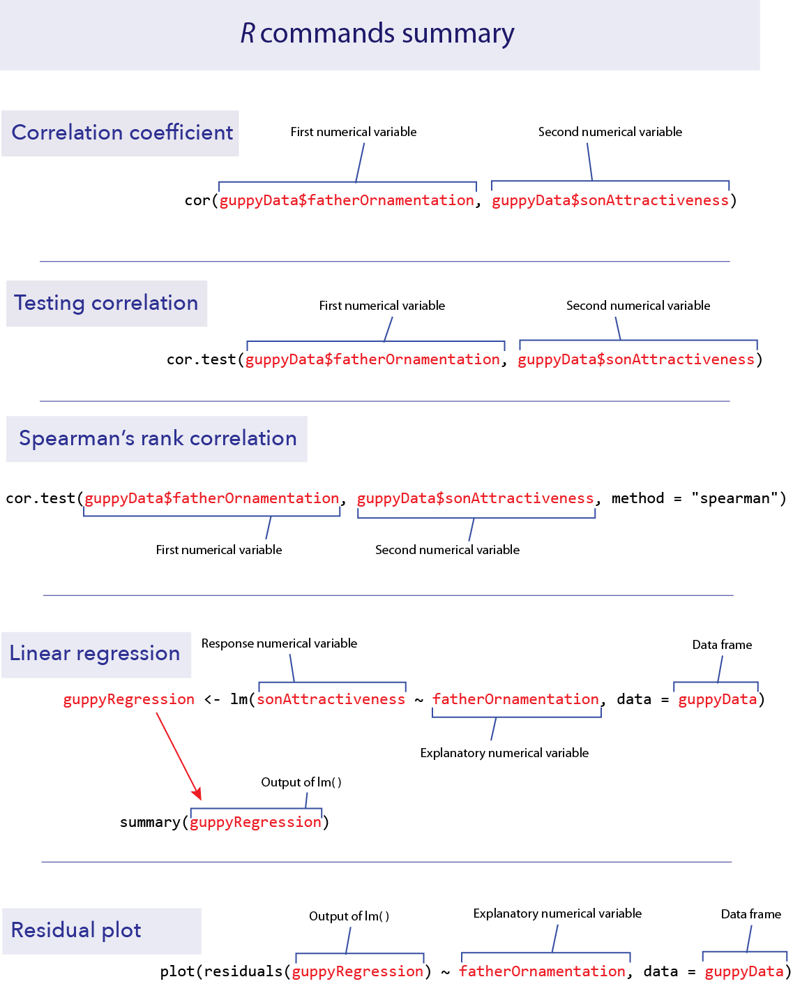
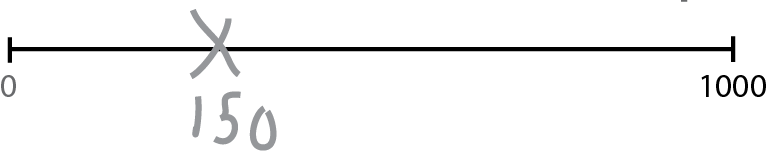

```{r setup, include=FALSE}
knitr::opts_chunk$set(echo = TRUE)
library(ggplot2)
```


*This lab is part of a series designed to accompany a course using *The Analysis of Biological Data*. The rest of the labs can be found [here](index.html). This lab is based on topics in Chapters 16 and 17 of ABD.*


<br>

# Learning outcomes

*	Calculate a correlation coefficient and the coefficient of determination

*	Test hypotheses about correlation

*	Use the non-parametric Spearman’s correlation

*	Estimate slopes of regressions

*	Test regression models

*	Plot regression lines

*	Examine residual plots for deviations from the assumptions of linear regression

<br> 

If you have not already done so, download [the zip file containing Data, R scripts, and other resources for these labs](ABDLabs.zip). Remember to start RStudio from the "ABDLabs.Rproj" file in that folder to make these exercises work more seamlessly.


***
<br>

# Learning the tools


<br>

This week we will look at methods to understand the relationship between two numerical variables, using correlation and regression.

To demonstrate the new R commands this week, we will use the data set from Figure 2.3-3 in Whitlock and Schluter. These data investigate the relationship between how ornamented a father guppy is (fatherOrnamentation) and how attractive to females are his sons (sonAttractiveness). Load the data from the .csv file:

```{r}
guppyData <- read.csv("DataForLabs/chap02e3bGuppyFatherSonAttractiveness.csv", stringsAsFactors = TRUE)
```


Before we go further, it is wise to plot a scatterplot to view the relationship of the two variables. (See Lab 3.)

```{r}
ggplot(guppyData, aes(x=fatherOrnamentation, 
   y=sonAttractiveness)) +
   geom_point() +
   theme_minimal() +
   xlab("Father's ornamentation") +
   ylab("Son's attractiveness")
```


Note that these data seem to have a moderately strong, positive relationship.

<br>  

## Correlation

<br>

### cor()

Calculating a correlation coefficient in R is straightforward. The function **cor()** calculates the correlation between the two variables given as input:

```{r}
cor(guppyData$fatherOrnamentation, guppyData$sonAttractiveness)
```

As we predicted from the graph, the correlation coefficient of these data is positive and fairly strong.

R has no explicit function for calculating the coefficient of determination. However, the coefficient of determination is simply the square of the correlation coefficient, so we can calculate it by simply squaring the output of **cor()**. Remember from Lab 1 that the caret sign (**^**) is used to denote exponents, as in the following example:

```{r}
cor(guppyData$fatherOrnamentation, guppyData$sonAttractiveness)^2
```

<br>

###  cor.test()

To test a hypothesis about the correlation coefficient or to calculate its confidence interval, use **cor.test()**. It takes as input the names of vectors containing the variables of interest.

```{r}
cor.test(guppyData$fatherOrnamentation, guppyData$sonAttractiveness)
```

The output gives many bits of information we might want. The title here, “Pearson’s product–moment correlation” is the technical name for the classic correlation coefficient. After, re-stating the names of the variables being used, the output gives us the test statistic *t*, degrees of freedom, and *P*-value of a test of the null hypothesis that the population correlation coefficient is zero. In this case the *P*-value is quite small, *P*  = 6.8 x 10^-5^. After that we have the 95% confidence interval for the correlation coefficient and finally the estimate of the correlation coefficient itself.

<br>

## Spearman’s correlation

The function **cor.test()** can also calculate a Spearman’s rank correlation, if we add the option **method = “spearman”** to the command.

```{r warning=FALSE}
cor.test(guppyData$fatherOrnamentation, guppyData$sonAttractiveness, method = "spearman")
```


The output here is similar to what we described above with a Pearson’s correlation. Spearman’s $\rho$ in this case is about 0.579.

<br>

## Linear regression

Regression in R is a two-step process similar to the steps used in ANOVA last week. In fact, we again start by using **lm()** to fit a linear model to the data. (Both ANOVA and regression are special cases of linear models, which also can be used to generate much more complicated analyses than these.) We then give the output of **lm()** to the function **summary()** to see many useful results of the analysis.

Using the **lm()** function to calculate regression is similar to the steps used for ANOVA. The first argument is a formula, in the form **response_variable ~ explanatory_variable**. In this case we want to predict son’s attractiveness from father’s ornamentation, so our formula will be **sonAttractiveness ~ fatherOrnamentation**. The second input argument is the name of the data frame with the data. We will want to assign the results to a new object with a name (we chose “**guppyRegression**”), so that we can use the results in later calculations with **summary()**.

```{r}
guppyRegression <- lm(sonAttractiveness ~ fatherOrnamentation, data = guppyData)
```

Let’s look at the output of **lm()** in this case.

```{r}
guppyRegression 

```


This tells us that the estimate of the slope of the regression line is 0.982285, and the *y*-intercept is estimated to be 0.005084. Therefore the line that is estimated to be the best fit to these data is

sonAttractiveness = 0.005084 + (0.982285 x fatherOrnamentation).


We can find other useful information by looking at the **summary()** of the **lm()** result:

```{r}
summary(guppyRegression)

```

We see the estimates of the slope and intercept repeated here, in the “Coefficients” table under “Estimate”. Now, we also are given the standard error and *P*-value for each of these numbers in that same table. For these data, the *P*-value for the null hypothesis that the true slope is zero is 6.78 x 10–5.

Plotting this line on the scatterplot is fairly straightforward in **ggplot()**. We can use the same plot function as above, with a new layer added with “**+ geom_smooth(method=lm)**” in the last line below:

```{r}
ggplot(guppyData, aes(x=fatherOrnamentation, 
   y=sonAttractiveness)) +
   geom_point() +
   theme_minimal() +
   xlab("Father's ornamentation") +
   ylab("Son's attractiveness") +    
   geom_smooth(method = lm)
```

This layer adds both the best-fitting regression line and also the 95% confidence interval for the line shown in grey shading. The outer edges of the shaded area represent the confidence bands, indicating the 95% confidence intervals for the mean of the Y-variable (son’s attractiveness) at each value of the X-variable (father’s ornamentation). If you want a plot without this confidence interval, add the argument **se = FALSE** to the **gm_smooth()** function, as in **geom_smooth(method=lm, se = FALSE)**.

<br>

## Residual plots

To check that the assumptions of regression apply for your data set, it is can be really helpful to look at a residual plot. A residual is the difference between the actual value of the *y* variable and the predicted value based on the regression line. 

<br>

### residuals()

R can calculate the residuals from a model with the **residuals()** function. Simply give this function the results from the **lm()** function, such as the **guppyRegression** that we calculated above. A vector of all the residuals for this regression line would be calculated by

```{r eval=FALSE}
residuals(guppyRegression)
```

With a residual plot, we plot the residuals of each data point as a function of the explanatory variable.

```{r}
plot(residuals(guppyRegression) ~ fatherOrnamentation, data = guppyData)

abline(h=0)

```


In this case we used the built-in function **plot()** because it is fast and easy, and this residual plot may only be for ourselves. The second command **abline(h=0)** adds the horizontal line at 0 to the plot so that it is easier to see the baseline.

This residual plot shows no major deviation from the assumptions of linear regression. There is no strong tendency for the variance of the residuals (indicated by the amount of scatter in the vertical dimension) to increase or decrease with increasing *x*. The residuals show no outliers or other evidence of not being normally distributed for each value of *x*.

<br>

# R commands summary




***
<br>

# Activities

<br>

## 1. Developing an intuition for correlation coefficients. 

In a web browser, open the app at [shiney.zoology.ubc.ca/whitlock/Guessing_correlation/](http://shiney.zoology.ubc.ca/whitlock/Guessing_correlation/) 

This app is simple—it will plot some data in a scatterplot, and you guess the correct correlation coefficient for those data. Select one of the three choices and click the little circle next to your choice. Most people find this pretty challenging at first, but that is the point—to let you develop a better intuition about what a given value of a correlation coefficient means for how strong a relationship is between two numerical variables.

Keep trying new data sets (by clicking the “Simulate new data” button) until you feel like you can get it right most of the time.

<br>

## 2. Visualizing residuals. 

Open another app at [http://shiney.zoology.ubc.ca/whitlock/Residuals/](http://shiney.zoology.ubc.ca/whitlock/Residuals/)  This app will let you visualize the meaning of the term “residual” and help to understand what a residual plot is. 

Start with the first tab (“1. Residuals”), and work through the tabs in order.


***
<br>

# Questions

<br>
1.  The ends of chromosomes are called telomeres. These telomeres are shortened a bit during each cell cycle as DNA is replicated. One of their purposes is to protect more valuable DNA in the chromosome from degradation during replication. As people get older and their cells have replicated more often, their telomeres shorten. There is evidence that these shortened telomeres may play a role in aging. Telomeres can be lengthened in germ cells and stem cells by an enzyme called telomerase, but this enzyme is not active in most healthy somatic cells. (Cancer cells, on the other hand, usually express telomerase.)

Given that the length of telomeres is biologically important, it becomes interesting to know whether telomere length varies between individuals and whether this variation is inherited. A set of data was collected by Nordfjäll et al. (2005) on the telomere length of fathers and their children; these data are in the file "telomere inheritance.csv".

a.	Create a scatter plot showing the relationship between father and offspring telomere length.

b.	Do the data require any transformation before analysis using linear regression?

c.	Estimate an equation that predicts the offspring telomere length from its father's. Is there evidence that the father's telomere length predicts his offspring's value?


<br>
2.  Opfer and Segler (2007) asked second- and fourth-grade school children to mark on a number line where a given number would fall. Each child was given a drawing of a number line with two ends marked at 0 and 1000, and was then asked to make an X on that line where a number, for example 150, should be placed. They asked each child to place several different numbers on the number lines, each on a fresh new piece of paper.



The researchers then measured the placement of each mark on a linear scale. The results, averaged over all 93 kids for each group, are given in the file "numberline.csv".

a.	Plot the fourth graders' guesses against the true value. Is this relationship linear? If not, find a transformation of *X* or *Y* that converts the relationship into an approximately linear one. 

b.	Plot the second-graders' guesses against the true value. Is this relationship linear? If not, find a transformation of *X* or *Y* that converts the relationship into an approximately linear one. Fit a linear regression to both the transformed and untransformed data. Examine the residual plots for both the transformed and untransformed data.

c.	Assume that the difference between the shapes of these curves is real. What would you conclude about the difference in the way 2nd graders and 4th graders perceive numbers?


<br>
3.  Larger animals tend to have larger brains. But is the increase in brain size proportional to the increase in body size? A set of data on body and brain size of 62 mammal species was collated by Allison and Cicchetti (1976), and these data are in the data set "mammals.csv”. The file contains columns giving the species name, the average body mass (in kg) and average brain size (in g) for each species. These are the same data used in the second half of the app about residuals that you used in the activities earlier in this lab.

a.	Plot brain size against body size. Is the relationship linear?

b.	Find a transformation (for either or both variables) that makes the relationship between these two variables linear. 

c.	Is there statistical evidence that brain size is correlated with body size? Assume that the species data are independent.

d.	What line best predicts (transformed) brain size from (transformed) body size?

e.	Based on your answer in (d), what is the predicted change in log-brain size accompanying an increase of 3 units of log- body size?

f.	Make a residual plot using the regression fitted to the transformed variables. Do the data look like they match the assumptions of linear regression?

g.	[**OPTIONAL** – hint: try using **filter()** from the **dplyr** package.]  Which species has the highest brain size relative to that predicted by its body size? Which species has the smallest brain relative to that predicted by its body size?
