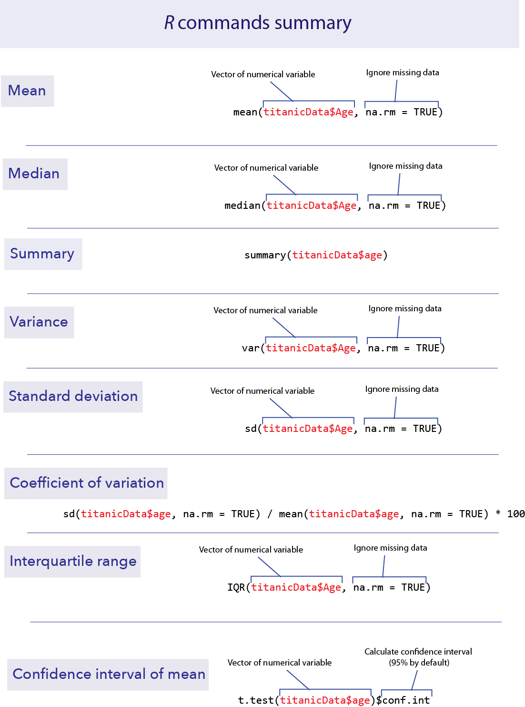
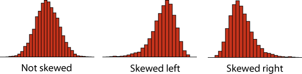

```{r setup, include=FALSE}
knitr::opts_chunk$set(echo = TRUE)
```


*This lab is part of a series designed to accompany a course using *The Analysis of Biological Data*. The rest of the labs can be found [here](index.html). This lab is based on topics in Chapters 3 and 4 of ABD.*


<br>

# Learning outcomes

*	Investigate sampling error; see that larger samples have less sampling error.

*	Visualize confidence intervals.

*	Calculate basic summary statistics using R.

*	Calculate confidence intervals for the mean with R.

<br> 

If you have not already done so, download [the zip file containing Data, R scripts, and other resources for these labs](ABDLabs.zip). Remember to start RStudio from the "ABDLabs.Rproj" file in that folder to make these exercises work more seamlessly.


***
<br>

# Learning the tools

<br>

## Missing data

Sometimes we do not have all variables measured on all individuals in the data set. When this happens, we need a space holder in our data files so that R knows that the data is missing. The standard way of doing this in R is to put “NA” (without the quotes) in the location that the data would have gone. NA is short for “not available”.

For example, in the Titanic data set, we do not know the age of several passengers. Let’s look at it. Load the Titanic data set:

```{r}
titanicData <- read.csv("DataForLabs/titanic.csv", stringsAsFactors = TRUE)
```

Have R print out the list of the age variable, which you can do easily by just typing its name:

```{r eval = FALSE}
titanicData$age
```

If you look through the results, you will see that most individuals have numbers in this list, but some have NA. These NAs are the people for which we do not have age information.

By the way, the titanic.csv file simply has nothing in the places where there is missing data. When R loaded it, it replaced the empty spots with NA automatically.


<br>

## Measures of location

This week we want to use R to give some basic descriptive statistics for numerical data. 

<br>


### mean()

We have already seen in lab 1 how to calculate the mean of a vector of data using **mean()**. Unfortunately, if there are missing data we need to tell R how to deal with it.

A (somewhat annoying) quirk of R is that if we try to take the mean of a list of numbers that include missing data, we get an NA for the result! 

```{r}
mean(titanicData$age)
```

<br>

### na.rm = TRUE

To get the mean of all the numbers that we do have, we have to add an option to the **mean()** function. This option is **na.rm = TRUE**. 

```{r}
mean(titanicData$age, na.rm = TRUE)
```

This tells R to remove (“rm”) the NAs before taking the mean. It turns out that the mean age of passengers that we have information for was about 31.2.

**na.rm = TRUE** can be added to many functions in R, including **median()**, as we shall see next.

<br>


### median()

The median of a series of numbers is the “middle” number – half of the numbers in the list are greater the median and half are below it. It can be calculated in R by using **median()**.

```{r}
median(titanicData$age, na.rm = TRUE)
```

<br>


### summary()

A handy function that will return both the mean and median at the same time (along with other information such as the first and third quartiles) is **summary()**.

```{r}
summary(titanicData$age)
```


From left to right, this output gives us the smallest (minimum) value in the list (“**Min.**”), the first quartile (“**1st Qu.**”), the median, the mean, the third quartile (“**3rd Qu.**”), the largest (maximum) value (“**Max.**”), and finally, the number of individuals with missing values (”**NA’s**”).

The first quartile is the value in the data that is larger than a quarter of the data points. The third quartile is larger than ¾ of the data. These are also called the 25th percentile and the 75th percentile, respectively. (You may remember these from boxplots, where the top and bottom of the box mark the 75th and 25th percentiles, respectively.)


<br>

## Measures of variability

R can also calculate measures of the variability of a sample. In this section we’ll learn how to calculate the variance, standard deviation, coefficient of variation and interquartile range of a set of data.

<br>

### var()

To calculate the variance of a list of numbers, use **var()**. 

```{r}
var(titanicData$age, na.rm = TRUE)
```

Note that **var()**, as well as **sd()** below, have the same need for **na.rm = TRUE** when analyzing data that include missing values.


<br>


### sd()

The standard deviation can be calculated by **sd()**.

```{r}
sd(titanicData$age, na.rm = TRUE)
```

Of course, the standard deviation is the same as the square root of the variance.

```{r}
sqrt(var(titanicData$age, na.rm = TRUE))
```

<br>

### Coefficient of variation

Surprisingly, there is no standard function in R to calculate the coefficient of variation. You can do this yourself, though, directly from the definition:

```{r}
100 * sd(titanicData$age, na.rm = TRUE) / mean(titanicData$age, na.rm = TRUE) 
```

<br>


### IQR()

The interquartile range (or IQR) is the difference between the third quartile and the first quartile; in other words the range covered by the middle half of the data. It can be calculated easily with **IQR()**.

```{r}
IQR(titanicData$age, na.rm = TRUE)
```

Note that this is the same as we could calculate by the results from **summary()** above. The third quartile is 41 and the first quartile is 21, so the difference is 41 – 21 = 20.

<br>

## Confidence intervals of the mean

The confidence interval for an estimate tells us a range of values that is likely to contain the true value of the parameter. For example, in 95% of random samples the 95% confidence interval of the mean will contain the true value of the mean. 

R does not have a simple built-in function to calculate only the confidence interval of the mean, but the function that calculates *t*-tests will give us this information. (See chapters 11 and 12 in the text or Week 7 and 8 of these labs for more on *t*-tests.) The function **t.test()** has many results in its output. By adding **$conf.int** to this function we only get back the confidence interval for the mean. By default it gives us the 95% confidence interval.

```{r}
t.test(titanicData$age)$conf.int
```

As the result above shows, the 95% confidence interval of the mean of age in the **titanicData** data set is from about 30.0 to 32.3. R also tells us that it used a 95% confidence level for its calculation. (The confidence interval is not so useful in this case, because we actually have information for nearly all the individuals on the Titanic.)

To calculate confidence intervals with a different level of confidence, we can add the option **conf.level** to the **t.test** function. For example, for a 99% confidence interval we can use the following.

```{r}
t.test(titanicData$age, conf.level = 0.99)$conf.int
```


<br>

# R commands summary




***
<br>

# Activities

<br>

## 1. Distribution of sample means

Go to the web and open the page at [http://www.zoology.ubc.ca/~whitlock/kingfisher/SamplingNormal.htm](http://www.zoology.ubc.ca/~whitlock/kingfisher/SamplingNormal.htm). This page contains some interactive visualizations that let you play around with sampling to see the distribution of sampling means. Click the button that says “Tutorial” near the bottom of the page and follow along with the instructions.
<br>

## 2. Confidence intervals

Go back to the web, and open the page at [http://www.zoology.ubc.ca/~whitlock/kingfisher/CIMean.htm](http://www.zoology.ubc.ca/~whitlock/kingfisher/CIMean.htm) . This applet draws confidence intervals for the mean of a known population. Click “Tutorial” again, and follow along.


***
<br>

# Questions

<br>
1.  Your TA should provide a data file that includes data that your classmates collected on themselves during the first week of lab, in Lab 1. (If you are doing these outside of a class setting, anonymized data based on a previous class's answers is available as "studentSampleData.csv". A visual inspection of the class from which these data were taken showed that no one was below 100 cm in height, and no one had a particualrly large or small head.) Remember that these data were collected using measuring tapes based in inches, but the data file asked fo rthe measurements in centimenters. Open that file in R. 

a.	Plot the distribution of heights in the class. Describe the shape of the distribution. Is it symmetric or strongly skewed? Is it unimodal or bimodal?

*Key point: A distribution is skewed if it is asymmetric. A distribution is skewed right if there is a long tail to the right, and skewed left if there is a long tail to the left.*


b.	Are there any large outliers that look as though a student used the wrong units for their height measurement. (I.e., are there any that are more plausibly a height given in inches rather than the requested centimeters?)  If so, and if this is not likely to be an accurate description of an individual in your class, use **filter()** from the package **dplyr** to create a new data set without those rows.

c.	Use R to calculate the mean height of all students in the class, using the filtered data.

d.	Use **sd()** to calculate the standard deviation of height, using the filter data.


<br>
2.  The file "caffeine.csv" contains data on the amount of caffeine in a 16 oz. cup of coffee obtained from various vendors. For context, doses of caffeine over 25 mg are enough to increase anxiety in some people, and doses over 300 to 360 mg are enough to significantly increase heart rate in most people. A can of Red Bull contains 80mg of caffeine.

a.	What is the mean amount of caffeine in 16 oz. coffees?

b.	What is the 95% confidence interval for the mean? 

c.	Plot the frequency distribution of caffeine levels for these data in a histogram. Is the amount of caffeine in a cup of coffee relatively consistent from one vendor to another? What is the standard deviation of caffeine level? What is the coefficient of variation?

d.	The file "caffeineStarbucks.csv" has data on six 16 oz. cups of Breakfast Blend coffee sampled on six different days from a Starbucks location. Calculate the mean (and the 95% confidence interval for the mean) for these data. Compare these results to the data taken on the broader sample of vendors in the first file. Describe the difference.


<br>
3. A confidence interval is a range of values that are likely to contain the true value of a parameter. Consider the "caffeine.csv" data again. 

a.	Calculate the 99% confidence interval for the mean caffeine level.

b.	Compare this 99% confidence interval to the 95% confidence interval you calculate in question 2b. Which confidence interval is wider (i.e., spans a broader range)? Why should this one be wider?

c.	Let’s compare the quantiles of the distribution of caffeine to this confidence interval. Approximately 95% of the data values should fall between the 2.5% and 97.5% quantiles of the distribution of caffeine. (Explain why this is true.) We can use R to calculate the 2.5% and 97.5% quantiles with a command like the following. (Replace “datavector” with the name of the vector of your caffeine data.)

```{r eval=FALSE}
> quantile(datavector, c(0.025, 0.975), na.rm =TRUE)
```

Are these the same as the boundaries of the 95% confidence interval? If not, why not? Which should bound a smaller region, the quantile or the confidence interval of the mean?


<br>
4. Return to the class data set "studentSampleData.csv". Find the mean value of "number of siblings." Add one to this to find the mean number of children per family in the class.

a.	The mean number of offspring per family twenty years ago was about 2. Is the value for this class similar, greater, or smaller? If different, think of reasons for the difference.

b.	Are the families represented in this class systematically different from the population at large? Is there a potential sampling bias?

c.	Consider the way in which the data were collected. How many families with zero children are represented? Why? What effect does this have on the estimated mean family size of all couples?


<br>
5. Return to the data on countries of the world, in "countries.csv". Plot the distributions for **ecological_footprint_2000**, **cell_phone_subscriptions_per_100_people_2012**, and **life_expectancy_at_birth_female**.

a.	For each variable, plot a histogram of the distribution. Is the variable skewed? If so, in which direction? 

b.	For each variable, calculate the mean and median. Are they similar? Match the difference in mean and median to the direction of skew on the histogram. Do you see a pattern?
