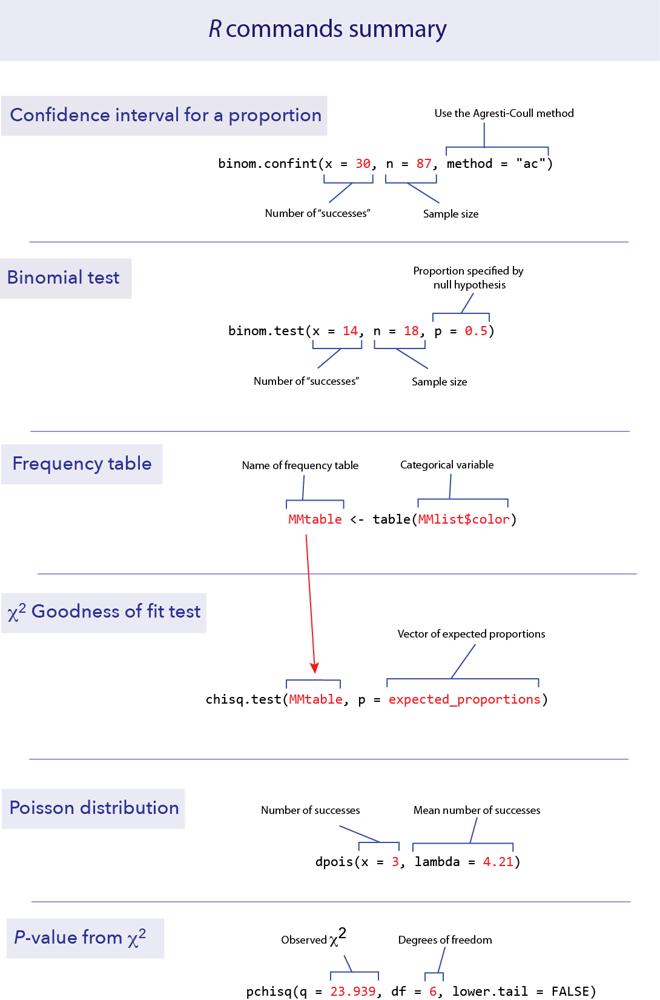
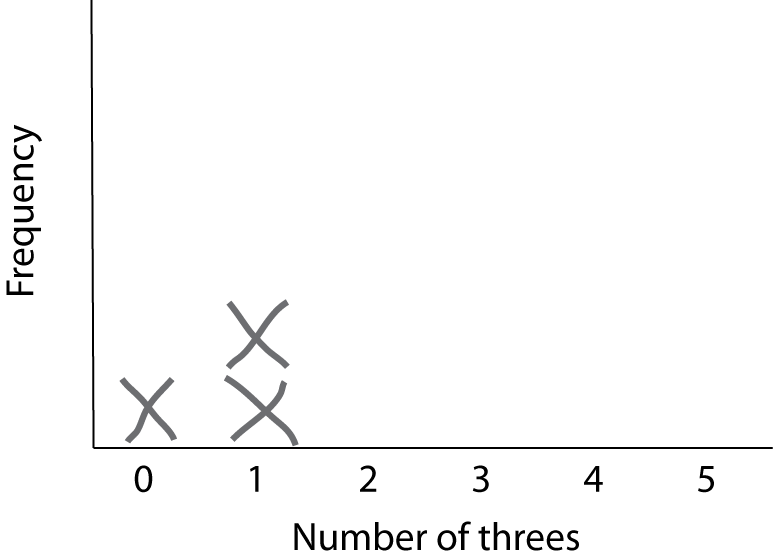
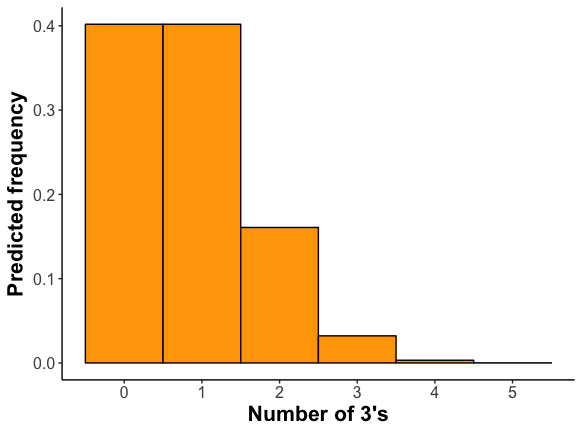

```{r setup, include=FALSE}
knitr::opts_chunk$set(echo = TRUE)
```


*This lab is part of a series designed to accompany a course using *The Analysis of Biological Data*. The rest of the labs can be found [here](index.html). This lab is based on topics in Chapters 7 and 8 of ABD.*


<br>

# Learning outcomes

*	Calculate a confidence interval for a proportion

*	Make a hypothesis test about proportions.

*	Fit frequency data to a model.

*	Test for a fit to a Poisson distribution.

<br> 

If you have not already done so, download [the zip file containing Data, R scripts, and other resources for these labs](ABDLabs.zip). Remember to start RStudio from the "ABDLabs.Rproj" file in that folder to make these exercises work more seamlessly.


***
<br>

# Learning the tools

<br>

## Confidence interval for a proportion

To calculate a confidence interval for an estimate of a proportion, we suggest using the Agresti-Coull method. This method is available in the R package “**binom**”, which you can install and load with the following:

```{r eval =FALSE}
install.packages("binom", dependencies = TRUE)
```

```{r}
library(binom)
```

Like any package, you only need to install it once, but you need to run the library command in each session before you can use it. 

Once the package is installed, calculating a confidence interval for a proportion is fairly straightforward. The function you need is called **binom.confint()**. You need to specify:

**x**: the number of successes

**n**:  the total sample size

**method**: “ac” for Agresti-Coull

For example, if we have 87 data points and 30 of them are “successes”, we can find the 95% confidence interval for the proportion of successes with the following command.


```{r}
binom.confint(x = 30, n = 87, method = "ac")
```


This tells us that the observed proportion (called “**mean**” here) is 0.3448, and the lower and upper bounds of the 95% confidence interval are 0.2532 and 0.4496.


<br>

## Binomial tests

Doing a binomial test in R is much easier than doing one by hand. 

<br>

### binom.test()

The function **binom.test()** will do an exact binomial test. It requires three pieces of information in the input: **x** for the number of “successes” observed in the data, **n** for the total number of data points, and **p** for the proportion given by the null hypothesis.

For example, if we have 18 toads that have been measured for a left-right preference and 14 are right-handed, we can test the null hypothesis of equal probabilities of left- and right-handedness with a binomial test. (See Example 6.2 in the text.) In this case, **x** = 14, **n** = 18, and **p** = 0.5.

```{r}
binom.test(x = 14, n = 18, p = 0.5)
```

In this case, the output of the function gives quite a bit of information. One key element that we will be looking for is the *P*-value; in this case R tells us that the *P*-value is 0.03088. This is the *P*-value that corresponds to a two-tailed test.

The **binom.test()** function also gives an estimate of the proportion of successes (in this case 0.7777778). (It also gives an approximate 95% confidence interval for the proportion using a different method than the Agresti-Coull method that we recommend.)


<br>

## Goodness of fit test

A $\chi$^2^ goodness-of-fit test compares the frequencies of values of a categorical variable to the frequencies predicted by a null hypothesis. For example, the file "MandMlist.csv" contains a list of all the colors of M&M candies from one package, under the variable “color”. Let’s ask whether this fits the proportions of colors advertised by the candy company.

```{r}
MMlist <- read.csv("DataForLabs/MandMlist.csv", stringsAsFactors = TRUE)
```

**MMlist$color** contains the color of each of 55 M&Ms. 

<br>

### table()

Summarizing frequency data in a table is useful to see the data more concisely, and such a table is also necessary as input to the $\chi$^2^ test function. We can summarize the counts (frequencies) of a categorical variable with **table()**.

```{r}
MMtable <- table(MMlist$color)

MMtable
```

This shows that in this list of M&M colors, 10 were blue, 5 were brown, etc.

<br>

### chisq.test()

We can use a $\chi$^2^ goodness-of-fit test to compare the frequencies in a set of data to a null hypothesis that specifies the probabilities of each category. In R, this can be calculated using the function **chisq.test()**. 

The company says that the percentages are 24% blue, 14% brown, 16% green, 20% orange, 13% red and 13% yellow. This is our null hypothesis. Let’s test whether these proportions are consistent with the frequencies of the colors in this bag. R wants the proportions expected by the null hypothesis in a vector, like this:

```{r}
expected_proportions <- c(0.24, 0.14, 0.16, 0.20, 0.13, 0.13)
```

Notice that R wants you to input the expected proportions, which it will use to calculate the expected frequencies. 

The first thing we need to do is check whether the expected frequencies (expected by the null hypothesis) are large enough to justify using a $\chi$^2^ goodness of fit test. (In other words, that no more than 25% of the expected frequencies are less than 5 and none is less than 1.) 

To obtain these expected counts, multiply the vector of the expected proportions by the total sample size. We can find the total sample size by taking the **sum()** of the frequency table:

```{r}
sum(MMtable)
```

So for this example, the expected frequencies from our null hypothesis are 55 times the list of expected proportions:

```{r}
55 * expected_proportions
```

All of these expected values are greater than 5, so we have no problem with the assumptions of the $\chi$^2^ goodness of fit test. (If there were a problem here, we’d have to combine categories. We’ll see an example of that in the next section.)

The function **chisq.test()** requires two arguments in its input: a frequency table from the data and a vector with the expected proportions from the null hypothesis. The name of the vector of expected proportions in this function is **p**. So here is the format of the R command to do a $\chi$^2^ test:

```{r}
chisq.test(MMtable, p = expected_proportions)
```


“X–squared” here in the output means $\chi$^2^. The $\chi$^2^ value for this test is 5.1442. There are 5 degrees of freedom (df) for this test, and the *P*-value turned out to be 0.3985. We wouldn't reject the null hypothesis with these data.


<br>

## Fit to a Poisson distribution

A $\chi$^2^ goodness of fit test can be used to ask whether a frequency distribution of a variable is consistent with a Poisson distribution. This is a useful way to determine if events in space or time are not “random” but instead are clumped or dispersed. 

It turns out that this is not a straightforward process in R. In this section, we’ll highlight a couple of functions in R that will streamline doing the calculations by hand. We’ll use the data on the numbers of extinctions per prehistoric time period described in Example 8.4 in the Whitlock and Schluter textbook.

```{r}
extinctData <- read.csv("DataForLabs/MassExtinctions.csv", stringsAsFactors = TRUE)

number_of_extinctions <- extinctData$numberOfExtinctions

table(number_of_extinctions)
```


The first row lists each possible number of extinctions in a time period, ranging from 1 to 20. The second row shows the number of time periods that had each number of extinctions. (so there were 13 time periods with one extinction, 15 time periods with 2 extinctions, etc.) 

The mean number of extinctions per unit of time is not specified by the null hypothesis, so we need to estimate it from the data. This mean turns out to be 4.21 extinctions per time period.

```{r}
mean(number_of_extinctions)
```

We can use this mean to calculate the probability according to a Poisson distribution of getting each specific number of extinctions. 

<br>

### dpois()

Fortunately, R has a function to calculate the probability of a given value under the Poisson distribution. This function is **dpois()**, which stands for “density of the Poisson”. **dpois()** requires two values for input, the mean (which is called **lambda** in this function) and **x**, the value of the outcome we are interested in (here, the number of extinctions). For example, the probability of getting *x* = 3 from a Poisson distribution with mean 4.21 can be found from the following:

```{r}
dpois(x = 3, lambda = 4.21)
```

The probability of getting exactly 3 successes from a Poisson distribution with mean 4.21 is about 18.5%.

**dpois()** will accept a vector of *x*’s as input, and return a vector of the probabilities of those *x*’s. A convenient short hand to know here is that R will create a vector with a range of values with a colon. For example, 0:20 is a vector with the integers from 0 to 20.

```{r}
0:20
```

We’ll need the probabilities for all possible values of *x* from 0 to 20 (because this was the largest value observed in the data). We can create a vector with the Poisson probabilities of each possibility from 0 to 20 like this:

```{r}
expected_probability <- dpois(x = 0:20, lambda = 4.21)

expected_probability
```

The odd notation here is a shorthand for scientific notation. 1.48e-02 means 1.48 x 10^-2^. The e stands for exponent.

Remember that we asked R to output the probability of values from 0 to 20. So the first value in this output corresponds to the probability of getting a zero, the second to the probability of getting a 1, etc.

In order to convert these probabilities into expected values for a $\chi$^2^ test, we need to multiply them by the total sample size. 

```{r}
length(number_of_extinctions) * expected_probability

```

Most of these values would cause problems for the $\chi$^2^ test because they are too small (less than 1). We need to combine categories in some reasonable way so that the expected frequencies match the assumptions of the $\chi$^2^ test. Let’s combine the categories for 0 and 1 successes, and combine everything greater than or equal to 8 into one category. It is possible to do this all in R, but you can also do it by hand, using the expected frequencies we just calculated.  Here is a table of the expected frequencies for these new combined categories, for both the observed and expected, summing over all the possibilities within each of these groupings. (E.g., the expected frequency for the category “0 or 1” is the sum of 1.128324 and 4.750244.)

Number of extinctions | Expected | Observed
------------- | ------------- | -------------
0 or 1 | 5.878568 | 13
2 |9.999264 |15
3 |14.032300 | 16
4 | 14.768996 |7
5 | 12.435494 | 10
6 | 8.725572 | 4
7 | 5.247808 | 2
8 or more |  4.911998 | 9

Note that these expected values are large enough to match the conditions of the $\chi$^2^ test.

Make vectors (using **c()**) for the observed and expected values for these new groups:

```{r}
expected_combined <- c(5.878568, 9.999264, 14.032300, 14.768996, 12.435494,  8.725572, 5.247808, 4.911998)

observed_combined <- c(13, 15, 16, 7, 10, 4, 2, 9)
```

From these we can calculate the $\chi$^2^ test statistic using **chisq.test()$statistic**. 

We give it first the list of observed values, then the expected values as **p**. Because we are giving the list of expected frequencies rather the expected probabilities, we need to give it the option **rescale.p = TRUE**. Finally, by adding **$statistic** at the end, R will only give us the $\chi$^2^ value as output. (We don’t yet want the full results of the test because R does not know to correct for the reduction in degrees of freedom caused by estimating the mean.)

```{r}
chisq.test(observed_combined, p = expected_combined, rescale.p = TRUE)$statistic
```

This correctly calculates our $\chi$^2^ value as 23.939. The warning message in red is because one of the expected values is under 5, but because this occurred in less than 20% of the categories, it is fine to proceed.

The degrees of freedom for this test are the number of categories minus the number of parameters estimated from the data minus one. We ended up using 8 categories and estimated one parameter from the data, so we have df = 8 – 1 – 1 = 6. 

<br>

### pchisq()

To calculate the correct *P*-value, we need to know probability of getting a $\chi$^2^ value greater than 23.939 from a distribution that has 6 degrees of freedom. R has a function we can use for this, called **pchisq()**. We are interested here in the probability above the observed $\chi$^2^ value, so we want the probability in the right (or upper) tail. To use this function, we need to specify three values: our observed $\chi$^2^ (confusingly called **q** in this function), the degrees of freedom (called **df**, thank goodness), and an option that tells us to use the upper tail (**lower.tail = FALSE**).

```{r}
pchisq(q = 23.939, df = 6, lower.tail = FALSE)
```

Thus, our *P-*value for this test of the fit of these data to a Poisson distribution is approximately 0.0005. We reject the null hypothesis that these extinction data follow a Poisson distribution.


<br>

# R commands summary




***
<br>

# Activities

<br>

## The binomial distribution

This is a simple, quick exercise meant to help you visualize the meaning of a binomial distribution. The binomial distribution applies to cases where we do a set number of random trials, and in each trial there is an equal and independent probability of a success. Let's say there are *n* trials and the probability of success is *p*. Of those *n* trials, anywhere between 0 and n of them could be a 'success" and the rest will be "failures." Let's call the number of successes *X*. 

As our example, let's roll five regular dice, and keep track of how many come up as "three." In this case, there are five trials, so *n* = 5. The probability of rolling a "three" is 1/6, so *p* = 0.1666.

Let's repeat the sampling process a lot of times. For each sample, roll five dice, and record the number of threes.

(If you don't have dice available, you can simulate rolling dice at https://shiney.zoology.ubc.ca/otto/Dice/)

For this exercise, let’s draw a histogram of the results by hand. First draw the axes, and then for each result draw an X stacked up in the appropriate place. For example, after three trials that got 0, 1, and 1 threes, respectively, the histogram will look like this:



Keep doing this until you have 20 or more samples. 

Here is the frequency distribution for this process as calculated from the binomial distribution. 


 
Is this similar to what you found? (Remember that with only a few trials, you don’t expect to exactly match the predicted distribution. If you increase your number of samples, the fit should improve.)

The expected mean number of threes is 0.833. (For the binomial distribution, the mean is *n* × *p*, or in this case 5 × 0.1666.) Calculate the mean number of threes in your samples.


***
<br>

# Questions

<br>
1.  Many hospitals still have signs posted everywhere banning cell phone use. These bans originated from studies on earlier versions of cell phones. In one such experiment, out of 510 tests with cell phones operating at near-maximum power, six disrupted a piece of medical equipment enough to hinder interpretation of data or cause equipment to malfunction. A more recent study found zero instances of disruption of medical equipment out of 300 tests.

a.	For the older data, use **binom.confint()** with the Agresti-Coull method to calculate the estimated proportion of equipment disruption. What is the 95% confidence interval for this proportion?

b.	For the data on the newer cell phones, use R to calculate the estimate of the proportion and its 95% confidence interval.


<br>
2.  It is difficult to tell what other people are thinking, and it may even be impossible to find out what they are thinking by asking them. A series of studies shows that we do not always know how our own thought processes are carried out.

A classic experiment by Wilson and Nisbett (1978) addressed this issue in a clever way. Participants were asked to decide which of four pairs of silk stockings were better, but the four stockings that they were shown side-by-side were in fact identical. Nearly all participants were able, however, to offer reasons that they had chosen one pair over the other. 

The four pairs of stockings were presented to the participants randomly with respect to which pair was in which position. However, of the 52 subjects who selected a pair of stockings, 6 chose the pair on the far left, 9 chose the pair in the left-middle, 16 chose the pair in the right-middle, and 21 chose the pair on the far right. None admitted later that the position had any role in their selection. These data are in a file called “stockings.csv”.

a. What are the expected frequencies for this scenario, under the null hypothesis that all four pairs of stockings are equally likely to be chosen.

b. Use **chisq.test()** to test the null hypothesis that the selection of the stockings was independent of position. 

c. *(Optional)* The function **chisq.test()** can take the data either as a data frame, as above, or as a vector of the observed counts, as  a parameter called **x** as input: 

```{r eval=FALSE}
chisq.test(x = c(6,9,16,21), p = c(0.25,0.25,0.25,0.25))
```

Try it using the specification of the counts, to see that you get the same answer as in (b). 


<br>
3.  Many people believe that the month in which a person is born predicts significant attributes of that person in later life. Such astrological beliefs have little scientific support, but are there circumstances in which birth month can have a strong effect on later life? One prediction is that elite athletes will disproportionately have been born in the months just after the age cutoff used to separate levels for young players of the sport. The prediction is that those athletes that are oldest within an age group will do better by being relatively older, and therefore will gain more confidence and attract more coaching attention than the relatively younger players in their same groups. As a result, they may be more likely to dedicate themselves to the sport and do well later. In the case of soccer, the cutoff for different age groups is generally August.

a.	The birth months (by three month interval) of soccer players competing in the Under-20's World Tournament are recorded in the data file "soccer_birth_quarter.csv" (from Barnsley et al. 1992). Plot these data. Do you see a pattern? 

b.	The numbers of people born in Canada by month is recorded in the file “Canadian_births.csv”. Compare the distribution of birth months of the soccer players to what would be expected by chance, assuming that the birth data for Canada is a good approximation for the population from which soccer players are drawn. Use the appropriate statistical test. Describe the pattern.


<br>
4.  Are cardiac arrests (or "heart attacks") equally likely to occur throughout the year? Or are some weeks more likely than others to produce heart attacks? One way to look at this issue is to ask whether heart attacks occur according to a probability model in which such events are independent of each other and equally likely at all times. If so, then the number of heart attacks per week will follow a Poisson distribution. The data file "cardiac arrests out of hospital.csv" contains data on the number of heart attacks per week from one hospital over five years. It records the number of heart attacks that occurred to individuals outside of the hospital who were then brought in for treatment (from Skogvoll and Lindqvist 1999). 

a.	Calculate a table of the observed frequencies of heart attacks per week.

b.	What is the mean number of heart attacks per week?

c.	For the mean you just calculated, use **dpois()** to calculate the probability of 0 heart attacks in a week assuming a Poisson distribution. Multiply that probability by the number of data points to calculate the expected frequency of 0 in these data under the null hypothesis of a Poisson distribution.

d.	Here is a table of the expected frequencies under the null hypothesis. (The expected frequency for zero heart attacks should match your calculation above.) Are these frequencies acceptable for use in a $\chi$^2^ goodness of fit test?

Number of heart attacks	| Expected
------------- | -------------
0 | 34.785295 
1	| 70.103698
2	| 70.640891
3	| 47.454800
4	| 23.909219  
5	| 9.636973  
6 or more	| 4.469124

e.	Create vectors in R for the observed and expected frequencies.

f.	Calculate the $\chi$^2^ for this hypothesis test, using **chisq.test()$statistic**.

g.	How many degrees of freedom should this $\chi$^2^ goodness of fit test have?

h.	Calculate the *P*-value for this test, using **pchisq()**.

i.	Summarize the results of this test. Does the frequency distribution of out-of-hospital cardiac events follow a Poisson distribution?
