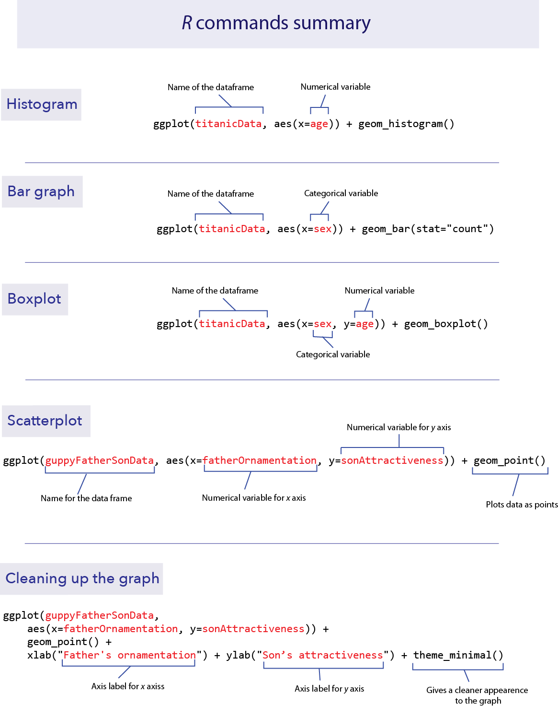
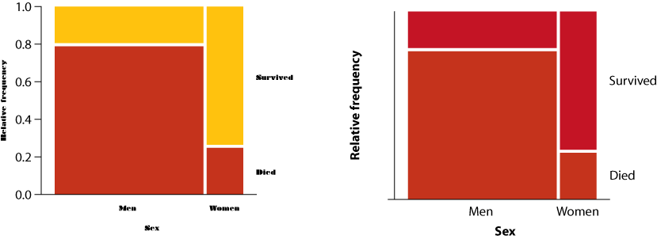

```{r setup, include=FALSE}
knitr::opts_chunk$set(echo = TRUE)
```


*This lab is part of a series designed to accompany a course using *The Analysis of Biological Data*. The rest of the labs can be found [here](index.html). This lab is based on topics in Chapter 2 of ABD.*


<br>

# Learning outcomes

*	Know some basic graphical formats and when they are useful.

*	Make graphs in R, such as histograms, bar charts, box plots, and scatter plots.

*	Be able to suggest improvements to basic graphs to improve readability and accurate communication

<br> 

If you have not already done so, download [the zip file containing Data, R scripts, and other resources for these labs](ABDLabs.zip). Remember to start RStudio from the "ABDLabs.Rproj" file in that folder to make these exercises work more seamlessly.

***
<br>

# Learning the tools


<br>

## ggplot

The function **ggplot()** allows us to graph most kinds of data relatively simply. Its syntax is slightly odd but very flexible. We’ll show specific commands for several types of plots below.

To begin, remember to load the package **ggplot2** with:

```{r}
library(ggplot2)
```

To make a graph with **ggplot()**, you need to specify at least two elements in your command. The first uses the function **ggplot()** itself, to specify which data frame you want to use and also which variables are to be plotted. The second part tells R what kind of graph to make, using a geom function. The odd part is that these two parts are put together with a **+** sign. It’s simplest to see this with an example. We’ll draw a histogram with **ggplot()** in the next section.


<br>

## Histograms

A histogram represents the frequency distribution of a numerical variable in a sample. 

Let’s see how to make a basic histogram using the age data from the Titanic data set. Make sure you have loaded the data (using **read.csv**) into a data frame called **titanicData**. 

```{r}
titanicData <- read.csv("DataForLabs/titanic.csv", stringsAsFactors = TRUE)
```

Here’s the code to make a simple histogram of age:

```{r}
ggplot(titanicData, aes(x=age)) + geom_histogram()
```

Notice that there are two functions called here, put together in a single command with a plus sign. The first function is **ggplot()**, and it has two input arguments. Listed first is **titanicData**; this is the name of the data frame containing the variables that we want to graph. The second input to ggplot is an **aes()** function. In this case, the **aes()** function tells R that we want **age** to be the *x*-variable (i.e. the variable that is displayed along the *x*-axis). (The **aes** stands for “aesthetics”,” but if you’re like us this won’t help you remember it any better.)

The second function in this command is **geom_histogram()**. This is the part that tells R that the “geometry” of our plot should be a histogram. 
 

This is not the most beautiful graph in the world, but it conveys the information. At the end of this lab we’ll see a couple of options that can make a ggplot graph look a little better. 


<br>

## Bar graphs

A bar graph plots the frequency distribution of a categorical variable. 

In **ggplot()**, the syntax for a bar graph is very similar to that for a histogram. For example, here is a bar graph for the categorical variable **sex** in the titanic data set. Aside from specifying a different variable for **x**, we use a different geom function here, **geom_bar**.

```{r}
ggplot(titanicData, aes(x=sex)) + geom_bar(stat="count")
```


<br>

## Boxplots

A boxplot is a convenient way of showing the frequency distribution of a numerical variable in multiple groups. Here’s the code to draw a boxplot for age in the titanic data set, separately for each sex:

```{r message = FALSE}
ggplot(titanicData, aes(x=sex, y=age)) + geom_boxplot()
```

Notice that the y variable here is **age**, and **x** is the categorical variable sex that winds up on the *x*-axis. See the result below, and look at where the variables are. The other new feature here is the new **geom** function, **geom_boxplot()**. 

 

Here the thick bar in the middle of each boxplot is the median of that group. The upper and lower bounds of the box extend from the first to the third quartile. (The "first quartile" is the 25^th^ percentile of the data--the value which is bigger than 25% of the other values. The "third quartile" is the 75^th^ percentile-- the value bigger than 3/4 of the other values.) 

The vertical lines are called whiskers, and they cover most of the range of the data (except when data points are pretty far from the median (see text), when they are plotted as individual dots, as on the male boxplot).


<br>

## Scatterplots

The last graphical style that we will cover here is the scatter plot, which shows the relationship between two numerical variables. 

The titanic data set does not have two numerical variables, so let’s use a different data set—the example from Figure 2.3-2 of Whitlock and Schluter, showing the relationship between the ornamentation of father guppies and the sexual attractiveness of their sons. You can load the data for that example with

```{r}
guppyFatherSonData <-read.csv("DataForLabs/chap02e3bGuppyFatherSonAttractiveness.csv")
```

To make a scatter plot of the variables fatherOrnamentation and sonAttractiveness with ggplot, you need to specify the **x** and **y** variables, and use **geom_point()**:

```{r}
ggplot(guppyFatherSonData,   
  aes(x = fatherOrnamentation, 
  y = sonAttractiveness)) +
  geom_point()
```


<br>

## Better looking graphics

The code we have listed here for graphics barely scratches the surface of what **ggplot**, and R as a whole, are capable of. Not only are there far more choices about the kinds of plots available, but there are many, many options for customizing the look and feel of each graph. You can choose the font, the font size, the colors, the style of the axes labels, etc., and you can customize the legends and axes legends nearly as much as you want.

Let’s dig a little deeper into just a couple of options that you can add to any of the forgoing graphs to make them look a little better. For example, you can change the text of the *x*-axis label or the *y*-axis label by using **xlab** or **ylab**. Let’s do that for the scatterplot, to make the labels a little nicer to read for humans.

```{r}
ggplot(guppyFatherSonData,   
    aes(x = fatherOrnamentation, y = sonAttractiveness)) +
    geom_point() +
    xlab("Father's ornamentation") + 
    ylab("Son’s attractiveness")
```

The labels that we want to add are included in quotes inside the **xlab** and **ylab** functions. Here is what appears:

 

It can also be nice to remove the default gray background, to make what some feel is a cleaner graph. Try adding 

```{r eval=FALSE}
+ theme_classic()
```

to the end of one of your lines of code making a graph, to see whether you prefer the result to the default design.

```{r}
ggplot(guppyFatherSonData,   
    aes(x = fatherOrnamentation, y = sonAttractiveness)) +
    geom_point() +
    xlab("Father's ornamentation") + 
    ylab("Son’s attractiveness") + 
    theme_classic()
```

<br>

## Getting help


The help pages in R are the main source of help, but the amount of detail might be off-putting for beginners. For example, to explore the options for **ggplot()**, enter the following into the R Console.

```{r}
help(ggplot)
```

This will cause the contents of the manual page for this function to appear in the Help window in RStudio. These manual pages are often frustratingly technical. What many of us do instead is simply google the name of the function—there are a great number of resources online about R. 

There are also many introductory books available. A good one is Dalgaard (2008) Introductory Statistics with R, 2nd ed.

<br>

# R commands summary




***
<br>

# Questions

Make a script in RStudio that collects all your R code required to answer the following questions. Include answers to the qualitative questions using comments.

<br>
1.  For each of the following pairs of graphs, identify features that communicate better on one version than the other. 

a.	Survivorship as a function of sex for passengers of the *RMS Titanic*


 
b.	Ear length in male humans as a function of age
 


<br>
2. Let’s use the data from “countries.csv” to practice making some graphs.

a.	Read the data from the file “countries.csv” in the Data folder.

b.	Make sure that you have run **library(ggplot2)**. Why is this necessary for the remainder of this question?

c.	Make a histogram to show the frequency distribution of values for **measles_immunization_oneyearolds**, a numerical variable. (This variable gives the percentage of 1-year-olds that have been vaccinated against measles.) Describe the pattern that you see.

d.	Make a bar graph to show the numbers of countries in each of the continents. (The categorical variable continent indicates the continent to which countries belong.)

e.	Draw a scatterplot that shows the relationship between the two numerical variables **life_expectancy_at_birth_male** and **life_expectancy_at_birth_female**. 


<br>
3. The ecological footprint is a widely-used measure, developed at UBC, of the impact a person has on the planet. It measures the area of land (in hectares) required to generate the food, shelter, and other resources used by a typical person and required to dispose of that person’s wastes. Larger values of the ecological footprint indicate that the typical person from that country uses more resources.

The countries data set has two variables for many countries showing the ecological footprint of an average person in each country. **ecological_footprint_2000** and **ecological_footprint_2012** show the ecological footprints for the years 2000 and 2012, respectively.

a.	Plot the relationship between the ecological footprint of 2000 and of 2012. 

b.	Describe the relationship between the footprints for the two years. Does the value of ecological footprint of 2000 seem to predict anything about its value in 2012?

c.	From this graph, does the ecological footprint tend to go up or down in the years between 2000 and 2012? Did the countries with high or low ecological footprint change the most over this time?  (Hint:  you can add a one-to-one line to your graph by adding **+ geom_abline(intercept = 0, slope = 1)** to your **ggplot** command. This will make it easier to see when your points are above or below the line of equivalence.) 


<br>
4. Use the countries data again. Plot the relationship between continent and female life expectancy at birth. Describe the patterns that you see. 

<br>
5. Muchhala (2006) measured the length of the tongues of eleven different species of South American bats, as well as the length of their palates (to get an indication of the size of their mouths). All of these bats use their tongues to feed on nectar from flowers. Data from the article are given in the file "BatTongues.csv". In this file, both Tongue Length and Palette Length are given in millimeters.

a.	Import the data and inspect it using **summary()**. You can call the data set whatever you like, but in one of the later steps we’ll assume it is called bat_tongues. Each value for tongue length and palate length is a species mean, calculated from a sample of individuals per species.

b.	Draw a scatter plot to show the association between palate length and tongue length, with tongue length as the response variable. Describe the association: is it positive or negative? Is it strong or weak? 

c.	All of the data points that went into this graph have been double checked and verified. With that in mind, what conclusion can you draw from the outlier on the scatter plot? 

d.	Let’s figure out which species is the outlier. To do this, we’ll use a useful function called **filter()** from the package **dplyr**. Use library to load **dplyr** to your R session.

e.	The function **filter()** gives us the row (or rows) of a data frame that has a certain property. Looking at the graph, we can tell that the point we are interested in has a very long tongue length, at least over 80 mm long! The following command will pull out the rows of the data frame **bat_tongues** that have **tongue_length** greater than 80 mm:

```{r eval=FALSE}
filter(bat_tongues,tongue_length>80)
```

The unusual species is *Anoura fistulata.* [See a photo here.](https://www.researchgate.net/figure/235352132_fig4_Figure-4-Partially-extended-tongue-of-A-fistulata-ICN-19653-from-Genova-Narino) This species has an outrageously long tongue, which it uses to collect nectar from a particular flower (can you guess what feature of the flower has led to the evolution of such a long tongue?). See the article by Muchhala (2006) to learn more about the biology of this strange bat. 


<br>
6. Import the data set collected on your class from the first lab. (We'll return to some of the other variables later in the term.) 

a.	Plot the relationship between the gender and height. Do you detect any outliers? Do all the data look as though the same units were used when students recorded them?

b.	Draw a histogram of the distribution of head circumference.


<br>
7. Pick one of the plots you made using R today. What could be improved about this graph to make it a more effective presentation of the data?