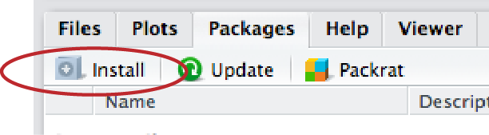
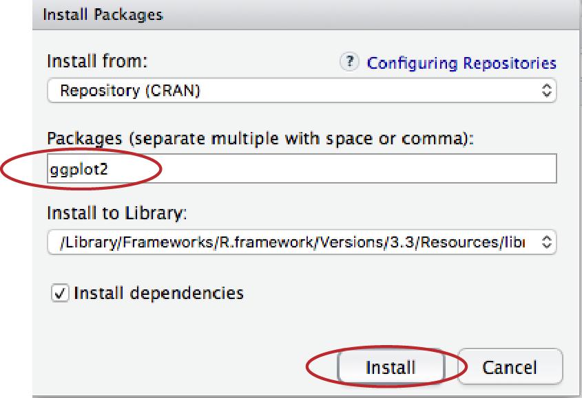
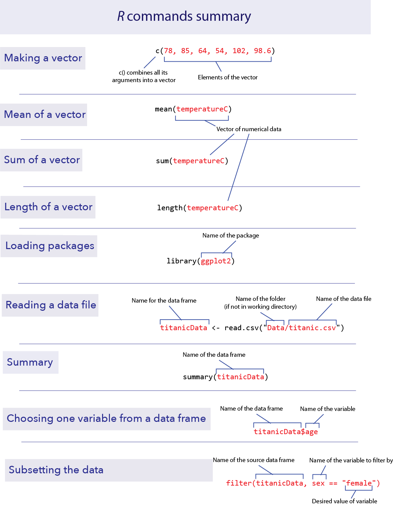

```{r setup, include=FALSE}
knitr::opts_chunk$set(echo = TRUE)
```


*This lab is part of a series designed to accompany a course using *The Analysis of Biological Data*. The rest of the labs can be found [here](index.html).*


<br>

# Learning outcomes

*	Learn how to increase the power of R with packages

*	Use vectors

*	Use data frames

<br> 

If you have not already done so, download [the zip file containing Data, R scripts, and other resources for these labs](ABDLabs.zip). Remember to start RStudio from the "ABDLabs.Rproj" file in that folder to make these exercises work more seamlessly.


***
<br>

# Learning the tools

<br>

## Vectors

One useful feature of R is the ability to sometimes apply functions to an entire collection of numbers. The technical term for a set of numbers is “vector”. For example, the following code will create a vector of five numbers:

```{r}
c(78, 85, 64, 54, 102, 98.6)
```

<br>

### c()

**c()** is a function that creates a vector, containing the list of items given in its arguments. To help you remember, you could think of the function **c()** meaning to “combine” some elements into a vector.

Let’s add a little extra here to make the computer remember this vector. Let’s assign it to a object, called **temperatureF** (because these numbers are actually a set of temperatures in degrees Fahrenheit):

```{r}
temperatureF <- c(78, 85, 64, 54, 102, 98.6)
```

The combination of the less than sign and the hyphen makes an arrow pointing from right to left—this tells R to assign the stuff on the right to the name on the left. In this case we are assigning a vector to the object **temperatureF**.

Inputting this to R causes no obvious output, but R will now remember this vector of temperatures under the name **temperatureF**. We can view the contents of the vector **temperatureF** by simply typing its name:

```{r}
temperatureF
```

The power of vectors is that sometimes R can do the same calculation on all elements of a vector with one command. For example, to convert a temperature in Fahrenheit to Celsius, we would want to subtract 32 and multiply times 5/9. We can do that for all the numbers in this vector at once:

```{r}
temperatureC <- (temperatureF - 32) * 5/9

temperatureC
```

To pull out one of the numbers in this vector, we add square brackets after the vector name, and inside those brackets put the index of the element we want. (The “index” is just a number giving the relative location in the vector of the item we want. The first item has index 1, etc.) For example, the second element of the vector **temperatureC** is

```{r}
temperatureC[2]
```

One of the common ways to slip up in R is to confuse the [square brackets] which pull out an element of a vector, with the (parentheses) , which is used to enclose the arguments of a function.

Vectors can also operate mathematically with other vectors. For example, imagine you have a vector of the body weights of patients before entering hospital (**weight_before_hospital**) and another vector with the same patient’s weights after leaving hospital (**weight_after_hospital**). You can calculate the change in weight for all these patients in one command, using vector subtraction:

```{r eval=FALSE}
weight_change_during_hospital <- weight_after_hospital - weight_before_hospital
```

The result will be a vector that has each patient’s change in weight.

<br>

## Basic calculation examples

In this course, we’ll learn how to use a few dozen functions, but let’s start with a couple of basic ones.

<br>

### mean()

The function **mean()** does just what it sounds like: it calculates the sample mean (that is, the average) of the vector given to it as input. For example, the mean of the vector of the temperatures in degrees Celsius from above is 26.81481:

```{r}
mean(temperatureC)
```
 
<br>


### sum()

Another simple (and simply named) function calculates the sum of all numbers in a vector: **sum()**.

```{r}
sum(temperatureC)
```

<br>

### length()

To count the number of elements in a vector, use **length()**.

```{r}
length(temperatureC)
```

This shows that there are 6 temperature values in the vector that make up the vector **temperatureC**.

<br>

## Expanding R’s capabilities

R has a lot of power in its basic form, but one of the most important parts about R is that it is expandable by the work of other people. These expansions are usually released in “packages”.  

Each package needs to be installed on your computer only once, but to be used it has to be loaded into R during each session.

To install a package in RStudio, click on the packages tab from the sub-window with tables for Files, Plots, Packages, Help, and Viewer. Immediately below that will be a button labeled “Install”—click that and a window will open. 



In the second row (labeled “Packages”),  type “ggplot2” (without the quotation marks). Make sure the box for “Install dependencies” near the bottom is clicked, and then click the “Install” button at bottom right. This will install the graphics package “ggplot2”.

  


This only needs to be done once on a given computer, and that package is permanently available.

There is another package that we will use in this course (including today) called **dplyr**. While you are installing packages, go ahead and install **dplyr** as well.


<br>

## Loading a package

Once a package is installed, it needs to be loaded into R during a session if you want to use it. You do this with a function called **library()**. 

<br>

### library()

For this lab, we will use the package **dplyr**, which allows for easy modification of data frames. Before using the functions in this package, we need to load it. We do this with the **library()** function. In the console, enter this:

```{r}
library(dplyr)
```

If the **dplyr** package is installed on your computer, the computer will just give a new prompt and be ready to go. If the package is not installed it will give you an error message in red asking you to get the package installed. (See the section above.)

<br>

## Setting the working directory


The files on your computers are organized hierarchically into folders, or “directories.” It is convenient in RStudio to tell R which directory to look for files at the beginning of a session, to minimize typing later.

For these labs, the best way to set your working directory is to start R and Rstudio by clicking on the “ABDLabs.Rproj” file in the ABDLabs directory. This will automatically load the needed packages and set the working directory to this folder.

You can also set the working directory for RStudio is from RStudio’s menu. From the “Session” tab in the menu bar, choose “Set Working Directory”, and then “Choose Directory…” This will open a dialog box that will let you find and select the directory you want. For these labs, we will assume that you are using as your working directory the “ABDLabs” folder that is distributed with this lab manual.


<br>

## Reading a file

In these labs, we have saved the data in a “comma-separated variable” format. All files in this format ought to have “.csv” as the end of their file name. A CSV file is a plain text file, easily read by a wide variety of programs. Each row in the file (besides the first row) is the data for a given individual, and for each individual each variable is listed in the same order, separated by commas. It’s important to note that you can’t have commas anywhere else in the file, besides the separators.

The first row of a CSV file should be a “header” row, which gives the names of each variable, again separated by commas.

<br>

### read.csv()

For examples in this lab, let’s use a data set about the passengers of the RMS Titanic. One of the data sets in the folder of data attached to this lab is called “titanic.csv”. This is a data set of 1313 passengers from the voyage of this ship, which contains information about some personal info about each passenger as well as whether they survived the accident or not.

To import a CSV file into R, use the **read.csv()** function as in the following command. (This assumes that you have set the working directory to ABDLabs, as we described above.)

```{r}
titanicData <- read.csv("DataForLabs/titanic.csv", stringsAsFactors = TRUE)
```


This looks for the file called titanic.csv in the folder called DataForLabs. Here we have given the name **titanicData** to the object in R that contains all this passenger data. Of course, if you wanted to load a different data set, you would be better off giving it a more apt name than “titanicData”. The option **"stringsAsFactors = TRUE"** asks R to interpret the columns with non-numerical information as "factor" with possibly repeated instances of the same value of a categorical variable.

To see if the data loads appropriately, you might want to run the command

```{r}
summary(titanicData)
```

which will list all the variables and some summary statistics for each variable.

R has other functions that can read other data formats besides csv files, but the function **read.csv()** requires that the file be a csv file.

<br>

### Finding files in other locations

For all of the examples in these labs, we have assumed that the data is in a folder called DataForLabs and that folder resides in the ABDLabs folder. When you work on a new data set outside of these labs, you will want to store the data somewhere else. To upload data from another location on your computer, you need to know the file path for the file. For example, the file path to the titanic file on my Mac is "/Users/whitlock/Desktop/ABDLabs/DataForLabs/titanic.csv". On a Windows machine, it would look something like "C:\\Documents\\ABDLabs\\DataForLabs\\titanic.csv". In either case, this file path is a list of folders inside of folders that tells the computer where to look for the file.

Reading a file from any location can be done with **read.csv** like this:


```{r eval=FALSE}
titanicData <- read.csv("/Users/whitlock/Desktop/ABDLabs/DataForLabs/titanic.csv", stringsAsFactors = TRUE)
```


<br>

## Introduction to data frames

A data frame is a way that R can store a data set on a number of individuals. A data frame is a collection of columns; each column contains the values of a single variable for all individuals. The values of each individual occur in the same order in all the columns, so the first value for one variable represents the same individual as the first value in the lists of all other variables.

The function **read.csv()** loads the data it reads into a data frame.

The data frame is usually given a name, which is used to tell R’s functions which data set to use. For example, in the previous section we read in a data set to a data frame that we called titanicData. This data frame now contains information about each of the passengers on the Titanic. This data frame has seven variables, so it has seven columns (**passenger_class**, **name**, **age**, **embarked**, **home_destination**, **sex**, and **survive**). 

Very importantly, we can grab one of the columns from a data frame by itself. We write the name of the data frame, followed by a **$**, and then the name of the variable. 

For example, to show a list of the age of all the passengers on the Titanic, use

```{r eval=FALSE}
titanicData$age
```

This will show a vector that has all the values for this variable age, one for each individual in the data set.

<br>

## Adding a new column

Sometimes we would like to add a new column to a data frame. The easiest way to do this is to simply assign a new vector to a new column name, using the **$**.

For example, to add the log of age as a column in the **titanicData** data frame, we can write 

```{r}
titanicData$log_age = log(titanicData$age)
```

You can run the command **head(titanicData)** to see that **log_age** is now a column in **titanicData**.

```{r}
head(titanicData)
```

<br> 

## Choosing subsets of data

Sometimes we want to do an analysis only on some of the data that fit certain criteria. For example, we might want to analyze the data from the Titanic using only the information from females.

The easiest way to do this is to use the **filter()** function from the package **dplyr**. Make sure you have sourced the **dplyr** package as described above, and then load it into R using **library()**: 

```{r}
library(dplyr)
```

In the titanic data set there is a variable named sex, and an individual is female if that variable has value “female”. We can create a new data frame that includes only the data from females with the following command:

```{r}
titanicDataFemalesOnly <- filter(titanicData, sex == "female")
```

This new data frame will include all the same columns as the original titanicData, but it will only include the rows for which the sex was “female”.

Note that the syntax here requires a double **==** sign.  In R (and many other computer languages), the double equal sign creates a statement that can be evaluated as true or false, while a single equal sign may change the value of the object to the value on the right-hand side of the equal sign. Here we are asking, for each individual, whether sex is “female”, not assigning the value ”female” to the variable sex. So we use a double equal sign **==**.

<br>

# R commands summary




***

<br>

# Questions

For the answers to the following questions, remember create a script that captures each of these calculations, and use comments to record your verbal answers. Also, use comments to indicate the questions numbers. Make sure to include your name and the date in a comment at the top.

<br>
1.  People are notoriously dishonest about revealing how often they perform antisocial behaviors like peeing in swimming pools. (In addition to being disgusting, the nitrogenous chemicals in urine combine with the pool’s chlorine to produce some toxic chemicals like trichloramine, the source of most skin irritations for swimmers.) A group of researchers (Jmaiff Blackstock et al. 2017) recently realized that an artificial sweetener called ACE passes out in urine unmetabolized and in known average quantities, and therefore by measuring ACE concentrations we can measure the amount of urine in a pool.

Here is a list of measurements, each from a different pool, of the concentration of ACE (measured in ng/L) for 23 different pools in Canada.

640, 1070, 780, 70, 160, 130, 60, 50, 2110, 70, 350, 30, 210, 90, 470, 580, 250, 310, 460, 430, 140, 1070, 130

a.	In R, create a vector of these data, and name it appropriately.

b.	What is the mean ACE concentration of these 23 pools?

c.	Urine on average has 4000 ng ACE/ ml. Therefore to convert these measurements of ng ACE / L pool water to ml urine / L pool water we need to divide each by 4000. Make a new vector showing the concentration of urine per liter in these 23 pools. Give it a suitable name.

d.	What is the mean concentration of urine per liter? How did this change relative to the mean measurement of ng ACE / L ?

e.	The arithmetic mean is calculated by adding up all the numbers and dividing by how many numbers there are. Calculate the mean of these numbers using **sum()** and **length()**. Did you get the same answer as with using **mean()**?

f.	Use R to calculate the average amount of urine (in ml) in a 500,000 L pool.

<br>


<br>
2.  Weddell seals live in Antarctic waters and take long strenuous dives in order to find fish to feed upon. Researchers (Williams et al. 2004) wanted to know whether these feeding dives were more energetically expensive than regular dives (perhaps because they are deeper, or the seal has to swim further or faster). They measured the metabolic costs of dives using the oxygen consumption of 10 animals (in ml O~2~ / kg) during a feeding dive. (Photo above by Giuseppe Zibordi, NOAA Photo Library)

Here are the data:

71.0, 77.3, 82.6, 96.1, 106.6, 112.8, 121.2, 126.4, 127.5, 143.1

For the same 10 animals, they also measured the oxygen consumption in non-feeding dives. With the 10 animals in the same order as before, here are those data:

42.2, 51.7, 59.8, 66.5, 81.9, 82.0, 81.3, 81.3, 96.0, 104.1

a.	Make a vector for each of these lists, and give them appropriate names.

b.	Confirm (using R) that both of your vectors have the same number of individuals in them.

c.	Create a vector called **MetabolismDifference** by calculating the difference in oxygen consumption between feeding dives and nonfeeding dives for each animal.

d.	What is the average difference between feeding dives and nonfeeding dives in oxygen consumption?

e.	Another appropriate way to represent the relationship between these two numbers would be to take the ratio of O~2~ consumption for feeding dives over the O~2~ consumption of nonfeeding dives. Make a vector which gives this ratio for each seal.

f.	Sometimes ratios are easier to analyze when we look at the log of the ratio. Create a vector which gives the log of the ratios from the previous step. (Use the natural log.) What is the mean of this log-ratio? 


<br>
3.  The data file called “countries.csv” in the DataForLabs folder contains information about all the countries on Earth. Each row is a country, and each column contains a variable.

a.	Use **read.csv()** to read the data from this file into a data frame called countries.

b.	Use **summary()** to get a quick description of this data set. What are the first three variables?

c.	Using the output of **summary()**, how many countries are from Africa in this data set?

d.	What kinds of variables (i.e., categorical or numerical) are **continents**, **cell_phone_subscriptions_per_100_people_2012**, **total_population_in_thousands_2015** and **fines_for_tobacco_advertising_2014**? (Don't go by their variable names – look at the data in the summary results to decide.)

e.	Add a new column to your countries data frame that has the difference in ecological footprint between 2012 and 2000.  What is the mean of this difference? (Note:  this variable will have “missing data”, which means that some of the countries do not have data in this file for one or the other of the years of ecological footprint.  By default, R doesn’t calculate a mean unless all the data are present. To tell R to ignore the missing data, add an option to the **mean()** command that says **na.rm=TRUE**. We’ll learn more about this later.)


<br>
4.  Using the countries data again, create a new data frame called **AfricaData**, that only includes data for countries in Africa. What is the sum of the **total_population_in_thousands_2015** for this new data frame?