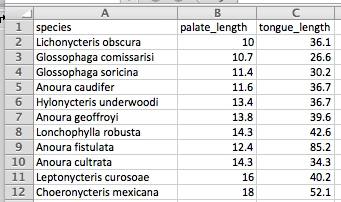
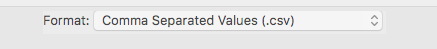

```{r setup, include=FALSE}
knitr::opts_chunk$set(echo = TRUE)
```

*This lab is part of a series designed to accompany a course using *The Analysis of Biological Data*. The rest of the labs can be found [here](index.html). *

<br>

# Learning outcomes


*	Learn to create data files for R.

<br> 

If you have not already done so, download [the zip file containing Data, R scripts, and other resources for these labs](ABDLabs.zip). Remember to start RStudio from the "ABDLabs.Rproj" file in that folder to make these exercises work more seamlessly.


***
<br>

# Learning the tools

<br>

## Structure of a good data file

Data files appear in many formats, and different formats are sometimes preferable for different tasks. But there is one way to structure data—called “long” format—that is extremely useful for most things that you will want to do in statistics and R.

Long format is actually very simple. Every row in the data set is a unique individual. Every column is a variable being measured on those individuals.

For example, last week in Question 5 we looked at some data about the tongue and palate lengths of several species of bats. There were three variables in that data set, the species name, tongue length, and palate length. Here each “individual” is a species. Here is that data in long format—each row is an individual. There are three columns, one for each variable:

species	| palate_length	| tongue_length
------------- | ------------- | -------------
Lichonycteris obscura	| 10| 	36.1
Glossophaga comissarisi	| 10.7 |	26.6
Glossophaga soricina |	11.4	| 30.2
Anoura caudifer	| 11.6 |	36.7
Hylonycteris underwoodi	| 13.4	| 36.7
Anoura geoffroyi	| 13.8	| 39.6
Lonchophylla robusta	| 14.3	| 42.6
Anoura fistulata	| 12.4	| 85.2
Anoura cultrata	| 14.3	| 34.3
Leptonycteris curosoae	| 16	| 40.2
Choeronycteris mexicana	| 18	| 52.1

<br>

## Creating a data file

When you have new data that you want to get into the computer in a format that R can read, it is often easiest to do this outside of R. A spreadsheet program like Excel (or a freely available program like OpenOffice Calc) is a straightforward way to create a .csv file that R can read.

In your spreadsheet program, open a new window with New Workbook under the File menu. (In OpenOffice, under the File menu, choose New and then Spreadsheet.) In the first row of your new spreadsheet, write your variable names, one for each column. (Be sure to give them good names that will work in R. Mainly, don't have any spaces in a variable name and make sure that it doesn't start with a number or contain punctuation marks. See Week 1 for more about naming variables.)

On the rows immediately below that first row, enter the data for each individual, in the correct column. Here’s what the spreadsheet would look like for the bat data after they are entered:



<br>

## Saving as a .csv file

Saving a spreadsheet in a format that R can read is very straightforward. In these labs, we are using .csv files (which stands for comma separated values). Once you have made your spreadsheet, under “File” click on “Save as…”. This will open a dialog box. First, give the file a name with the extension .csv at the end. We used “BatTongues.csv”. Then choose what folder you want to save the file in.

Finally, choose the right format for the file. The right format is “Comma separated values” which you can choose from after Format: in the dialog box. It might look something like this:

 

In the resulting file, the first line will be a header that lists the names of each column (variable). After that there will be one line for each individual. All the variable names in the first row and the variable values in the later rows will be separated by commas, hence the name of the format. If you opened the .csv file in a text editor, it would look like this:

***

species,palate_length,tongue_length <br>
Lichonycteris obscura,10,36.1 <br>
Glossophaga comissarisi,10.7,26.6 <br>
Glossophaga soricina,11.4,30.2 <br>
Anoura caudifer,11.6,36.7 <br>
Hylonycteris underwoodi,13.4,36.7 <br>
Anoura geoffroyi,13.8,39.6 <br>
Lonchophylla robusta,14.3,42.6 <br>
Anoura fistulata,12.4,85.2 <br>
Anoura cultrata,14.3,34.3 <br>
Leptonycteris curosoae,16,40.2 <br>
Choeronycteris mexicana,18,52.1 <br>

***

All the information is there, and it is stored in a simple text file that can be read again by Excel or R or many other programs.

***

<br>


These skills can be practiced in the Activity lists in the [Sampling activity, lab 4b.](R_tutorial_Sampling.html)

If you're doing these labs on your own ( or in the absence of in person groups), an [alternative set of questions for COVID-era practice making data files](Lab4aNewQuestions2020.pdf) is available, and [the data sheets you need for those questions are here](DataSheetsLab4.pdf).