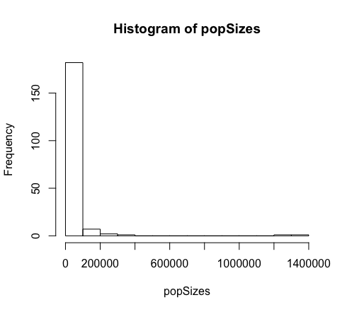
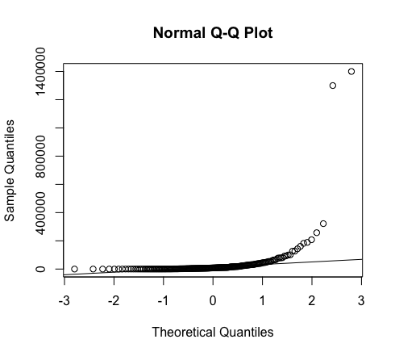
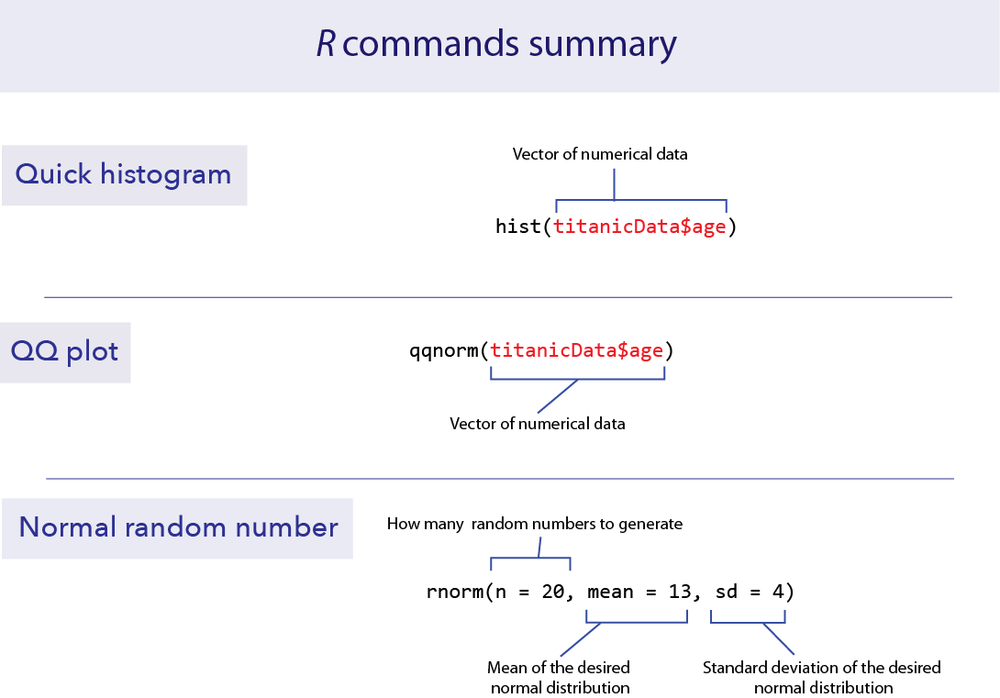

```{r setup, include=FALSE}
knitr::opts_chunk$set(echo = TRUE)
library(ggplot2)
```


*This lab is part of a series designed to accompany a course using *The Analysis of Biological Data*. The rest of the labs can be found [here](index.html). This lab is based on topics in Chapters 10 and 11 of ABD.*


<br>

# Learning outcomes

*	Visualize properties of the normal distribution.

*	Understand the Central Limit Theorem.

*	Calculate sampling properties of sample means.

*	Decide whether a data set likely comes from a normal distribution 

<br> 

If you have not already done so, download [the zip file containing Data, R scripts, and other resources for these labs](ABDLabs.zip). Remember to start RStudio from the "ABDLabs.Rproj" file in that folder to make these exercises work more seamlessly.


***
<br>

# Learning the tools

This lab mainly focuses on some exercises to better understand the nature of the normal distribution. We will also learn a couple of tools that help us decide whether a particular data set is likely to have come from population with an approximately normal distribution.

Many statistical tests assume that the variable being analyzed has a normal distribution. Fortunately, many of these tests are fairly robust to this assumption—that is, they work reasonably well even when this assumption is not quite true, especially when sample size is large. Therefore it is often sufficient to be able to assess whether the data come from a distribution whose shape is even approximately normal (the bell curve).

A good way to start is to simply visualize the frequency distribution of the variable in the data set by drawing a histogram. Let’s use the age of passengers on the Titanic for our example.

```{r}
titanicData <- read.csv("DataForLabs/titanic.csv", stringsAsFactors = TRUE)
```
 
 Remember we can use **ggplot()** to draw histograms.

```{r}
ggplot(titanicData, aes(x = age)) +   
  geom_histogram(binwidth = 10)
```


<br>

## hist()
If we are just drawing a histogram for ourselves to better understand the data, it is even easier to just use a function from base R, **hist()**. Give **hist()** a vector of data as input, and it will print a histogram in the plots window.

```{r}
hist(titanicData$age)
```

Looking at this histogram, we see that the frequency distribution of the variable is not exactly normal; it is slightly asymmetric and there seems to be a second mode near 0. On the other hand, like the normal distribution, the frequency distribution has a large mode near the center of the distribution, frequencies mainly fall off to either side, and there are no outliers. This is close enough to normal that most methods would work fine.


<br>

## QQ plot

Another graphical technique that can help us visualize whether a variable is approximately normal is called a quantile plot (or a QQ plot). The QQ plot shows the data on the vertical axis ranked in order from smallest to largest (“sample quantiles” in the figure below). On the horizontal axis, it shows the expected value of an individual with the same quantile if the distribution were normal (“theoretical quantiles” in the same figure). The QQ plot should follow more or less along a straight line if the data come from a normal distribution (with some tolerance for sampling variation).  

QQ plots can be made in R using a function called **qqnorm()**. Simply give the vector of data as input and it will draw a QQ plot for you. (**qqline()** will draw a line through that Q-Q plot to make the linear relationship easier to see.)

```{r}
qqnorm(titanicData$age)
qqline(titanicData$age)
```

This is what the resulting graph looks like for the Titanic age data. The dots do not land along a perfectly straight line. In particular the graph curves at the upper and lower end. However, this distribution definitely would be close enough to normal to use most standard methods, such as the *t*-test.

It is difficult to interpret QQ plots without experience. One of the goals of today’s exercises will be to develop some visual experience about what these graphs look like when the data is truly normal. To do that, we will take advantage of a function built into R to generate random numbers drawn from a normal distribution. This function is called **rnorm()**.

<br>

## rnorm()

The function **rnorm()** will return a vector of numbers, all drawn randomly from a normal distribution. It takes three arguments:

<br>      **n**:      how many random numbers to generate (the length of the output vector)

<br>      **mean**: the mean of the normal distribution to sample from

<br>      **sd**:     the standard deviation of the normal distribution 

For example, the following command will give a vector of 20 random numbers drawn from a normal distribution with mean 13 and standard deviation 4:

```{r}
rnorm(n = 20, mean = 13, sd = 4)
```

Let’s look at a QQ plot generated from 100 numbers randomly drawn from a normal distribution:

```{r}
normal_vector <- rnorm(n = 100, mean = 13, sd = 4)
qqnorm(normal_vector)
qqline(normal_vector)
```


These points fall mainly along a straight line, but there is some wobble around that line even though these points were in fact randomly sampled from a known normal distribution. With a QQ plot, we are looking for an overall pattern that is approximately a straight line, but we do not expect a perfect line. In the exercises, we’ll simulate several samples from a normal distribution to try to build intuition about the kinds of results you might get.

When data are not normally distributed, the dots in the quantile plot will not follow a straight line, even approximately. For example, here is a histogram and a QQ plot for the population size of various counties, from the data in countries.csv. These data are very skewed to the right, and do not follow a normal distribution at all.




<br>

## Transformations

When data are not normally distributed, we can try to use a simple mathematical transformation on each data point to create a list of numbers that still convey the information about the original question but that may be better matched to the assumptions of our statistical tests. We’ll see more about such transformations in chapter 13 of Whitlock and Schluter, but for now let’s learn how to do one of the most common data transformations, the log-transformation.

With a transformation, we apply the same mathematical function to each value of a given numerical variable for individual in the data set. With a log-transformation, we take the logarithm of each individual’s value for a numerical variable.

We can only use the log-transformation if all values are greater than zero. Also, it will only improve the fit of the normal distribution to the data in cases when the frequency distribution of the data is right-skewed.

To take the log transformation for a variable in R is very simple. We simply use the function **log()**, and apply it to the vector of the numerical variable in question. For example, to calculate the log of age for all passengers on the Titanic, we use the command:

```{r eval=FALSE}
log(titanicData$age)
```

This will return a vector of values, each of which is the log of age of a passenger.


<br>

# R commands summary




***
<br>

# Activities

<br>

## Activity 1. Give the TA the finger(s)

*Skip if you are doing this lab outside of a group setting*  Using [Student Data Sheet 7](Student data sheet 7.pdf), please make the suggested measurements and record them on the sheet. Then, if you don't mind sharing these data with the class, give the sheet to your TA who will compile them for use in Question 4.


## Activity 2. Distribution of sample means

We return to the applet we used in tutorial 3, located at [http://www.zoology.ubc.ca/~whitlock/Kingfisher/SamplingNormal.htm](http://www.zoology.ubc.ca/~whitlock/Kingfisher/SamplingNormal.htm) to investigate three points made in the text.

<br>
**Point 1: The distribution of sample means is normal, if the variable itself has a normal distribution.**
First, hit "COMPLETE SAMPLE OF 10" and “CALCULATE MEAN” a few times, to remind yourself of what this applet does. (It takes a sample from the normal distribution shown when you click “SHOW POPULATION”. The top panel shows a histogram of that sample, and the bottom panel shows the distribution of sample means from all the previous samples.)

Next, hit the "MEANS FOR MANY SAMPLES" button. This button makes a large number of separate samples at one go, all of the same sample size, to save you from making the samples one by one. Notice that the sample mean differs from sample to sample. The sample mean produced by random sampling from a probability distribution is itself a random variable.

Look at the distribution of sample means. Does it seem to have a normal distribution? Click the checkbox by "SHOW SAMPLING DISTRIBUTION" off to the right, which will draw the curve for a normal distribution with the same mean and variance as this distribution of sample means.

<br>
**Point 2: The standard deviation of the distribution of sample means is reduced with larger sample sizes.**
The standard deviation of the population is controlled by the right slider marked with $\sigma$. The sample size is set by left slider. (The default when it opens is set to *n*=10.)

For *n*=10, have the applet calculate a large number of sample means as you did in the previous exercise. If each sample size is 10 and the standard deviation is 30 (as in the default), what do you predict the standard deviation of the sample means to be? (Use the equation you have learned in class to make this calculation.)

Change the sample size to *n*=100, and recalculate many sample means. Calculate the predicted standard deviation of all the sample means. Should the sampling distribution of sample means be wider or narrower with this larger sample size than in the previous case with a smaller sample size? What do you observe in the simulations?

<br>
**Point 3: The distribution of sample means is approximately normal no matter what the distribution of the variable, as long as the sample size is large enough. (The Central Limit Theorem)**
Load another web page:  [http://www.zoology.ubc.ca/~whitlock/Kingfisher/CLT.htm](http://www.zoology.ubc.ca/~whitlock/Kingfisher/CLT.htm)

This will simulate a very skewed distribution of data, showing the number of cups of coffee drunk per week for a population of university students. Click on “COFFEE” to see the distribution of the variable among individual students. Describe the ways that this looks different from a normal distribution.

Set *n*=2 for the sample size, and simulate many sample means. Does the distribution of sample means look normal? Is it closer to normal in its shape than the distribution of individuals in the population?

Now set *n*=25 and simulate many sample means. How does the distribution of sample means look now? It should look much more like a normal distribution, because of the Central Limit Theorem. 


***
<br>

# Questions

<br>
1.  Let’s use R’s random number generator for the normal distribution to build intuition for how to view and interpret histograms and QQ plots. Remember, the lists of values generated by **rnorm()** come from a population that truly have a normal distribution. 

a.	Generate a list of 10 random numbers from a normal distribution with mean 15 and standard deviation 3, using the following command: 

```{r}
normal_vector <- rnorm(n = 10, mean = 15, sd = 3)
```

b.	Use **hist()** to plot a histogram of these numbers from part *a*.

c.	Plot a QQ plot from the numbers in part *a*.

d.	Repeat a through c several times (at least a dozen times). For each, look at the histograms and QQ plots. Think about the ways in which these look different from the expectation of a normal distribution (but remember that each of these samples comes from a truly normal population).


<br>
2.  Repeat the procedures of Question 1, except this time have R sample 250 individuals for each sample. (You can use the same command as in Question 1, but now set *n* = 250.) Do the graphs and QQ plots from these larger samples look more like the normal expectations than the smaller sample you already did? Why do you think that this is?

<br>
3.  In 1898, Hermon Bumpus collected house sparrows that had been caught in a severe winter storm in Chicago. He made several measurements on these sparrows, and his data are in the file “bumpus.csv”.

Bumpus used these data to observe differences between the birds that survived and those that died from the storm. This became one of the first direct and quantitative observations of natural selection on morphological traits. Here, let’s use these data to practice looking for fit of the normal distribution. (We’ll return to this data set next week to look for evidence of natural selection.)

a.	Use **ggplot()** to plot the distribution of total length (this is the length of the bird from beak to tail). Does the data look as though it comes from distribution that is approximately normal?

b.	Use **qqnorm()** to plot a QQ plot for total length. Does the data fall approximately along a straight line in the QQ plot? If so, what does this imply about the fit of these data to a normal distribution?

c.	Calculate the mean of total length and a 95% confidence interval for this mean. (You may want to refer back to Week 5 for the R commands to do this.)


<br>
*Skip Q4 if you are doing this lab outside of a group setting*   
4. Earlier this lab you will have measured your fingers. We're going to use this data now and also in the next lab. We'll look at the ratio of the lengths of index finger over ring finger. This is called the 2D:4D ratio, where the 2D refers to second digit and 4D means fourth digit. 


It turns out—bizarrely—that this 2D:4D ratio is a measure of the amount of testosterone that a fetus is exposed to during gestation. Next week we'll test whether that corresponds to differences for males and females. For this week, we'll estimate the 2D:4D ratio, and ask whether its mean is significantly different from 1. If index fingers are equal to ring fingers in length, then the ratio would be one. 

First, use the finger data file your TA has compiled. Create a new vector called "Right_2D_4D_ratio". In this vector, calculate the ratio of the length of the index finger over the length of the ring finger for each individual.

a.	Describe how well the “Right_2D_4D_ratio” is fit by a normal distribution, by using at least one of the two methods we have learned this week. 

b.	What is the 95% confidence interval for "Right_2D_4D_ratio"?  (You may need to refer back to Week 5.)


<br>
5.  The file "mammals.csv" contains information on the body mass of various mammal species. 

a.	Plot the distribution of body mass, and describe its shape. Does this look like it has a normal distribution?

b.	Transform the body mass data with a log-transformation. Plot the distribution of log body mass. Describe the new distribution, and examine it for normality.


