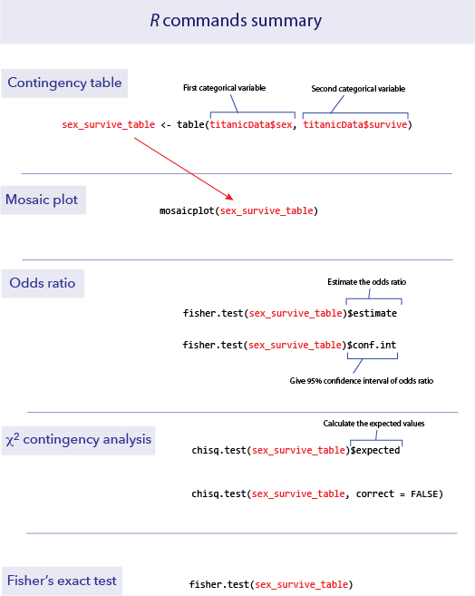

```{r setup, include=FALSE}
knitr::opts_chunk$set(echo = TRUE)
```


<br>

# **Goals**

*	goal 1

*	goal 2

*	goal 3

***
<br>

# **Learning the tools**


<br>

## Some h2 text like this


<br>

# **R commands summary**




***
<br>

# **Activities**

<br>

## 1. 1st activity


***
<br>

# **Questions**

<br>
1.  


<br>
2.  