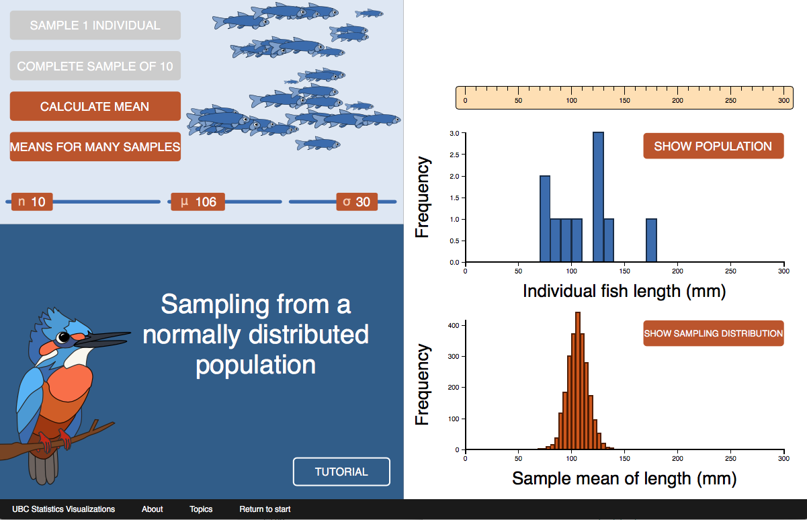
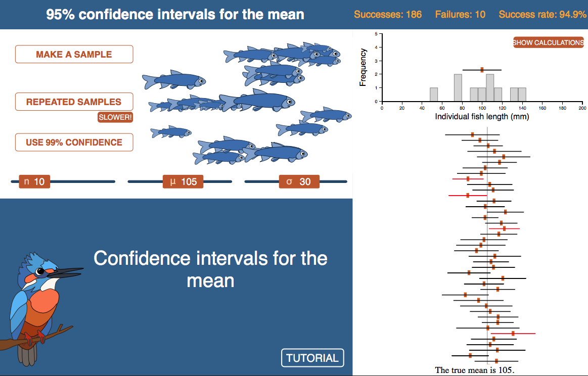

```{r setup, include=FALSE}
knitr::opts_chunk$set(echo = TRUE)
```

***

<br> 

# Chapter links

Download [Video](https://royalsocietypublishing.org/action/downloadSupplement?doi=10.1098%2Frsbl.2009.0311&file=rsbl20090311supp3.mpg) of tree shrews fertilizing a pitcher plant by using it as a lavatory.

<br>

# Web visualizations

A web visualization that demonstrates the properties of the mean calculated from a saample [here](https://www.zoology.ubc.ca/~whitlock/Kingfisher/SamplingNormal.htm). 

[](https://www.zoology.ubc.ca/~whitlock/Kingfisher/SamplingNormal.htm)

<br>

A web visualization that demonstrates the idea of the confidence interval [here](https://www.zoology.ubc.ca/~whitlock/Kingfisher/CIMean.htm).

[](https://www.zoology.ubc.ca/~whitlock/Kingfisher/CIMean.htm)

<br>

# R lab

A lab on how to compute confidence intervals for means in R, and related topics, is available [here](RLabs/R_tutorial_Describing_data.html).

<br>

# Learn R by example

We used R to analyze all examples in chapter 4. We've put the code [here](RExamples/Rcode_Chapter_4.html) so that you can too.

<br> 

# Data

Download a .zip file with all the data for chapter 4 in .csv format [here](DataZipFiles/chapter04.zip). 

Download a .zip file with all data sets in the book [here](DataZipFiles/Data.zip). 

All data sets and their sources are listed individually below.

Disclaimer: Most data sets used in the book are grabbed from graphs and tables in the original publications, and the values may not be exact. Contact the original authors for the raw data.

<br> 

## Data for examples

[Example 4.1. Human gene lengths](Data/chapter04/chap04e1HumanGeneLengthsLongestTranscript.csv)

Zerbino, D. R. et al. 2018. *Nucleic Acids Research* 46: D754–D761.

<br>

## Data for problem sets

[07. Firefly flashes](Data/chapter04/chap04q07FireflyFlash.csv) 

Cratsley, C. K., and S. M. Lewis. 2003. *Behavioral Ecology* 14: 135–140.

[09. Gene regulatory networks](Data/chapter04/chap04q09NumberGenesRegulated.csv) 

Guelzim, N., S. Bottani, P. Bourgine, and F. Képès. 2002. *Nature Genetics* 31: 60–63.

[18. Corpse flowers](Data/chapter04/chap04q18Corpseflowers.csv) 

Beath, D. D. 1996. *Journal of Ecological Ecology* 12:409-418.
