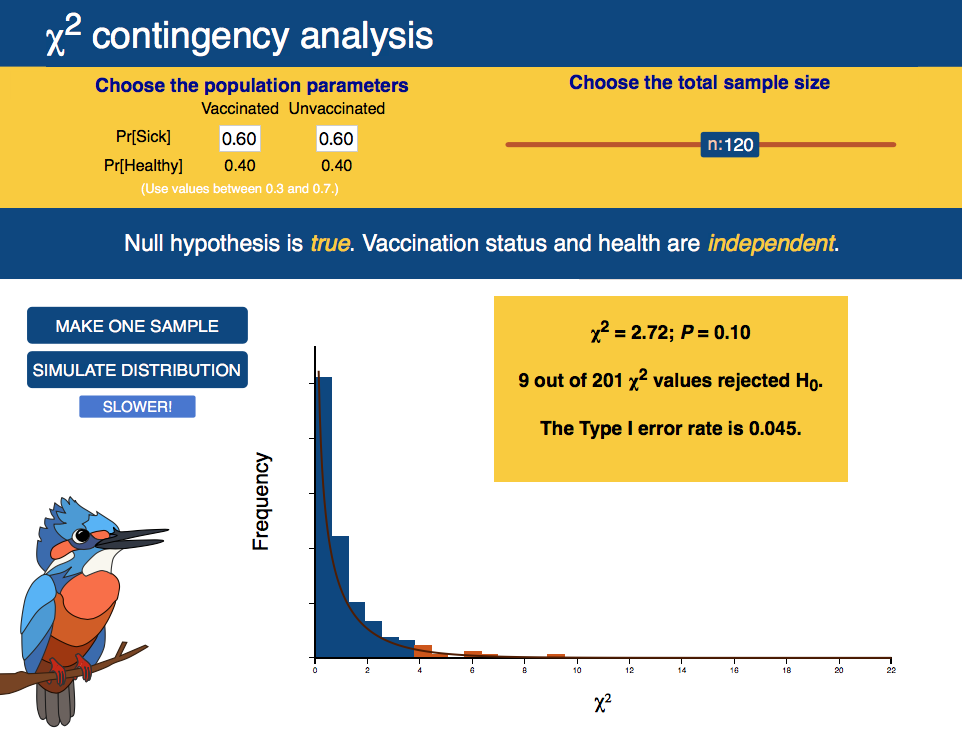

***

```{r setup, include=FALSE}
knitr::opts_chunk$set(echo = TRUE)
```

<br>

# Web visualizations

A web visualization that demonstrates Type 1 and Type 2 errors in hypothesis testing is [here](http://www.zoology.ubc.ca/~whitlock/Kingfisher/ContingencyAnalysis.htm), using as an example the $\chi$^2^ contingency analysis that is covered in chapter 9. 

[](http://www.zoology.ubc.ca/~whitlock/Kingfisher/ContingencyAnalysis.htm)

<br>

# Data

Chapter 6 has no associated data sets.

Download a .zip file with all data sets in the book [here](DataZipFiles/Data.zip). 

