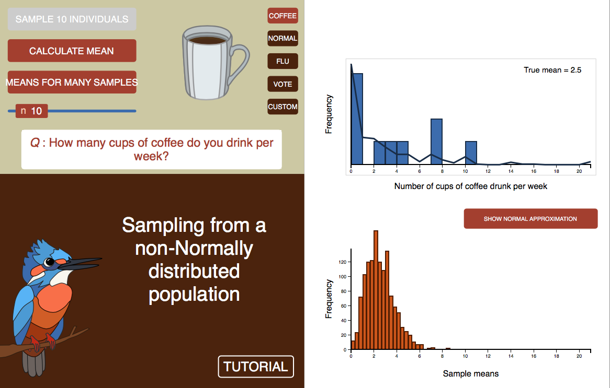

***

```{r setup, include=FALSE}
knitr::opts_chunk$set(echo = TRUE)
```

<br>

# Web visualizations

A web visualization about the Central Limit Theorem and sampling from non-Normal distributions is [here](https://www.zoology.ubc.ca/~whitlock/Kingfisher/CLT.htm). 

[](https://www.zoology.ubc.ca/~whitlock/Kingfisher/CLT.htm)

<br>

# R lab

A lab on investigating the normal distrirbution using R, and related topics, is available [here](RLabs/R_tutorial_Normal_and_sample_means.html).

<br>

# Learn R by example

We used R to analyze all examples in chapter 10. We've put the code [here](RExamples/Rcode_Chapter_10.html) so that you can too.

<br> 

# Data

Download a .zip file with all the data for chapter 10 in .csv format [here](DataZipFiles/chapter10.zip). 

Download a .zip file with all data sets in the book [here](DataZipFiles/Data.zip). 

All data sets and their sources are listed individually below.

Disclaimer: Most data sets used in the book are grabbed from graphs and tables in the original publications, and the values may not be exact. Contact the original authors for the raw data.

<br> 

## Data for examples

[Example 10.6. Deaths from Spanish flu 1918](Data/chapter10/chap10e6AgesAtDeathSpanishFlu1918.csv)

Human Mortality Database. University of California, Berkeley (USA), and Max Planck Institute for Demographic Research (Germany). Available at [www.mortality.org](www.mortality.org) or [www.humanmortality.de](www.humanmortality.de). Accessed January 18, 2012.

<br>

## Data for problem sets

[17. Tree growth rate](Data/chapter10/chap10q17TreeGrowthRate.csv) 

Clark, D. B., and D. A. Clark. 2012. *Ecology* 93: 213.

[25. Crab spiders](Data/chapter10/chap10q25beeSpiderChoice.csv)

Heiling, A. M., M. E. Herberstein, and L. Chittka. 2003. Crab spiders manipulate flower signals. Nature 421: 334.
