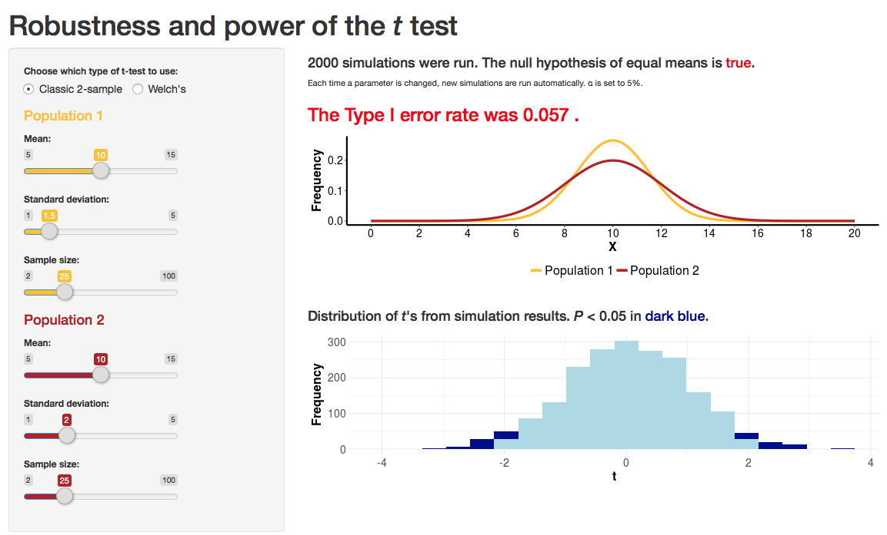

```{r setup, include=FALSE}
knitr::opts_chunk$set(echo = TRUE)
```

***

<br> 

# Chapter links

A useful description of Levene's test is [here](http://www.itl.nist.gov/div898/handbook/eda/section3/eda35a.htm)

[Vampre bats running](http://www.nature.com/nature/journal/v434/n7031/extref/434292a-s2.mov) for problem 10.


<br>

# Web visualizations

A web visualization that demonstrates the diffferences in power and Type 1 error rates between Welch's and 2-sample *t*-tests is [here](https://shiney.zoology.ubc.ca/whitlock/RobustnessOfT/). 

[](https://shiney.zoology.ubc.ca/whitlock/RobustnessOfT/)

<br>

# R lab

A lab on how to carry out two-sample *t*-tests in R, and related topics, is available [here](RLabs/R_tutorial_Comparing_means_of_2_groups.html).

<br>

# Learn R by example

We used R to analyze all examples in chapter 12. We've put the code [here](RExamples/Rcode_Chapter_12.html) so that you can too.

<br> 

# Data

Download a .zip file with all the data for chapter 12 in .csv format [here](DataZipFiles/chapter12.zip). 

Download a .zip file with all data sets in the book [here](DataZipFiles/Data.zip). 

All data sets and their sources are listed individually below.

Disclaimer: Most data sets used in the book are grabbed from graphs and tables in the original publications, and the values may not be exact. Contact the original authors for the raw data.

<br> 

## Data for examples

[Example 12.2. Blackbird testosterone](Data/chapter12/chap12e2BlackbirdTestosterone.csv) 

Hasselquist, D., J. A. Marsh, P. W. Sherman, and J. C. Wingfield. 1999. *Behavioral Ecology and Sociobiology *45: 167–175.

[Example 12.3. Horned lizards](Data/chapter12/chap12e3HornedLizards.csv) 

Young, A. J., et al. 2006. *Proceedings of the National Academy of Sciences (USA)* 103: 12005–12010.

[Example 12.4. Brook trout vs. salmon](Data/chapter12/chap12e4ChinookWithBrookTrout.csv) 

Levin, P. S., S. Achord, B. E. Fiest, and R. W. Zabel. 2002. *Proceedings of the Royal Society of London, Series B, Biological Sciences* 269: 1663–1670.


<br>

## Data for problem sets

[01. Death and taxes](Data/chapter12/chap12q01DeathAndTaxes.csv) 

Kopczuk, W., and J. Slemrod. 2003. *The Review of Economics and Statistics* 85: 256-265.

[8. Cichlids](Data/chapter12/chap12q08Cichlids.csv) 

Haeslery, M. P., and O. Seehausen. 2005. *Proceedings of the Royal Society of London, Series B, Biological Sciences* 272: 237-245. 

[9. "Will"s and presidents](Data/chapter12/chap12q09WillsPresidents.csv) 

Source is unknown.

[11. Ostrich temperatures](Data/chapter12/chap12q11OstrichTemp.csv) 

Fuller, A., et al. 2003.  *The Journal of Experimental Biology* 206: 1171-1181. 

[13. Iguanas](Data/chapter12/chap12q13Iguanas.csv) 

Wikelski, M., and C. Thom. 2000. *Nature* 403: 37-38. 

[15. Mosquitoes and beer](Data/chapter12/chap12q15BeerAndMosquitoes.csv) 

Lefävre, T. 2010. *PLoS ONE* 5:e9546.

[16. Mosquitoes and beer](Data/chapter12/chap12q15BeerAndMosquitoes.csv) 

Lefävre, T. 2010. *PLoS ONE* 5:e9546.

[17. Stalkie eyespan](Data/chapter12/chap12q17StalkieEyespan.csv) 

David, P., T. Bjorksten, K. Fowler, and A. Pomiankowski. 2000. *Nature* 406: 186-188. 

[19. Electric fish](Data/chapter12/chap12q19ElectricFish.csv) 

Fernandes, C. C., J. Podos, and J. G. Lundberg. 2004. *Science* 305: 1960-1962. 

[22. Weddell seal dives](Data/chapter12/chap12q22WeddellSeals.csv) 

Williams, T. M., L. A. Fuiman, M. Horning, and R. W. Davis. 2004. *The Journal of Experimental Biology* 207: 973-982. 

[23. Hyena giggles](Data/chapter12/chap12q23HyenaGiggles.csv) 

Mathevon, N., et al. 2010. *BMC Ecology* 10:9.

[26. Rat reciprocity](Data/chapter12/chap12q26RatReciprocity.csv) 

Rutte, C., and M. Taborsky. 2007.*PLoS Biology* 7: 1421-1425.

[27. Beer glassware](Data/chapter12/chap12q27BeerGlassShape.csv) 

Attwood, A. S., N. E. Scott-Samuel, G. Stothart, and M. R. Munafò. 2012. *PLoS ONE* 7:e43007.

[28. Spinocerebellar ataxia](Data/chapter12/chap12q28SpinocerebellarAtaxia.csv)  

Fryer, J. D., et al. 2011. *Science* 334: 690-693.

[29. Mother goats](Data/chapter12/chap12q29goatCalls.csv) 

Briefer, E. F., M. Padilla de la Torre, and A. G. McElligott. 2012. *Proceedings of the Royal Society B* doi:10.1098/rspb.2012.0986.

[30. Lianas](Data/chapter12/chap12q30Lianas.csv)  

Laurance, W. F., et al. 2014. *Ecology* 95: 1604-1611.

[31. Didgeridoo](Data/chapter12/chap12q31Didgeridoo.csv)  

Puhan, M. A.,  et al. 2006. *British Medical Journal* 2006: 332:266.

[33. Rewilding](Data/chapter12/chap12q33Rewild.csv)  

Leung, J. M., et al. 2018. *PLoS Biology* 16: e2004108.
