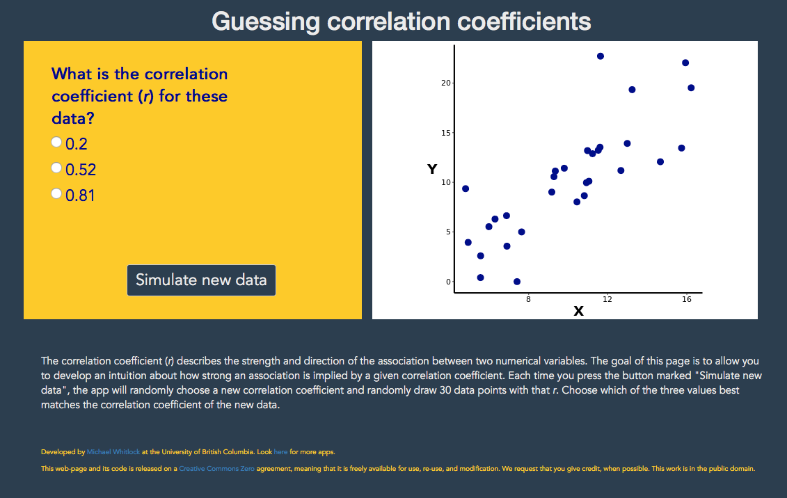

```{r setup, include=FALSE}
knitr::opts_chunk$set(echo = TRUE)
```

***

<br>

# Web visualizations

A web visualization to develop an intuition for the value of the correlation coefficient is [here](https://shiney.zoology.ubc.ca/whitlock/Guessing_correlation/). 

[](https://shiney.zoology.ubc.ca/whitlock/Guessing_correlation/)
<br>
<br>

# R lab

A lab on how to carry out correlation in R, and related topics, is available [here](RLabs/R_tutorial_Correlation_Regression.html).

<br>

# Learn R by example

We used R to analyze all examples in chapter 16. We've put the code [here](RExamples/Rcode_Chapter_16.html) so that you can too.

<br> 

# Data

Download a .zip file with all the data for chapter 16 in .csv format [here](DataZipFiles/chapter16.zip). 

Download a .zip file with all data sets in the book [here](DataZipFiles/Data.zip). 

All data sets and their sources are listed individually below.

Disclaimer: Most data sets used in the book are grabbed from graphs and tables in the original publications, and the values may not be exact. Contact the original authors for the raw data.

<br> 

## Data for examples

[Example 16.1. Flipping birds](Data/chapter16/chap16e1FlippingBird.csv)

Müller, M. S., et al. 2011. *The Auk* 128: 615-619.

[Example 16.2. Wolf inbreeding](Data/chapter16/chap16e2InbreedingWolvesRevised.csv)

Liberg, O. H.,et al. 2005. *Biology Letters* 1: 17-20. 

[Example 16.5. Indian rope trick](Data/chapter16/chap16e5IndianRopeTrick.csv)

Wiseman, R. and P. Lamont. 1996. *Nature* 383: 212-213. 

<br>

## Data for sets

[16.01. Hyena age](Data/chapter16/chap16q01Hyena GigglesAndAge.csv) 

Mathevon, N., et al. 2010. *BMC Ecology* 10: 9.

[16.03. TB resistance](Data/chapter16/chap16q03TBResistance.csv) 

Barnes, I., A. Duda, O. G. Pybus, and M. G. Thomas. 2011. *Evolution* 65: 842-848.

[16.05. Godwits](Data/chapter16/chap16q05GodwitArrivalDates.csv) 

Gunnarsson, T. G., J. A. Gill, T. Sigurbjörnsson, and W. J. Sutherland. 2004. *Nature* 431: 646. 

[16.10. Earwig forceps](Data/chapter16/chap16q10EarwigForceps.csv) 

Tomkins, J. L. and G. S. Brown. 2004. *Nature* 431: 1099-1103. 

[16.12. Cricket immunity](Data/chapter16/chap16q12CricketImmunitySpermViability.csv) 

Simmons, L. W. and B. Roberts. 2005.  *Science* 309: 2031. 

[16.13. Lefthandedness and violence](Data/chapter16/chap16q13LefthandednessAndViolence.csv) 

Faurie, C. and M. Raymond. 2005. *Proceedings of the Royal Society of London B* 272: 25-28. 

[16.14. Telomeres and stress](Data/chapter16/chap16q14TelomeresAndStress.csv) 

Epel, E. S., et al. 2004. *Proceedings of the National Academy of Sciences (USA)* 101: 17312-17315. 

[16.15. Language and grey matter](Data/chapter16/chap16q15LanguageGreyMatter.csv) 

Mechelli, A., et al. 2004. *Nature* 431: 757. 

[16.16. Green space](Data/chapter16/chap16q16GreenSpaceBiodiversity.csv) 

Fuller, R. A., et al. 2007. *Biology Letters* 3: 390-394. 

[16.18. Liver preparation](Data/chapter16/chap16q18LiverPreparation.csv) 

Smallwood, R. H., D. J. Morgan, G. W. Mihaly, and R. A. Smallwood. 1998. *Journal of Pharmacokinetics and Pharmacodynamics* 16: 397-411. 

[16.19. Sleep and performance](Data/chapter16/chap16q19SleepAndPerformance.csv) 

Huber, R., M. F. Ghilardi, M. Massimini, and G. Tononi. 2004. *Nature* 430: 78-81. 

[16.21. Trillium recruitment](Data/chapter16/chap16q21TrilliumRecruitment.csv) 

Jules, E. S. and B. J. Rathcke. 1999. *Conservation Biology* 13: 784-793. 

[16.22. Cocaine high](Data/chapter16/chap16q22CocaineHigh.csv) 

Volkow, N. D., et al. 1997. *Nature* 386: 827-830.

[16.23. Chocolate and Nobel Prizes](Data/chapter16/chap16q23ChocolateAndNobel.csv) 

Messerli, F. H. 2012. *New England Journal of Medicine* 367: 1562-1564.

[16.24. Antibody tumor screening](Data/chapter16/chap16q24AntibodyTumorScreening.csv) 

Ridgway, P. F., et al. 2004. *Journal of Surgical Research* 122: 83-88.

[16.25. Eyelash density](Data/chapter16/chap16q25mammalEyelashDensity.csv) 

Amador, G. J., 2015. *Journal of the Royal Society Interface* 12: 20141294.

[16.26. Moths in the wind](Data/chapter16/chap16q26windMothDirection.csv) 

Reynolds, A. M., et al. 2016. *Philosophical Transactions of the Royal Society B* 371: 20150392.

[16.27. Nitrogen and plant production](Data/chapter16/chap16q27nitrogenPlantProduction.csv) 

Stevens, C. J., 2015. *Ecology* 96: 1459-1465.

[16.28. Wildlife collisions](Data/chapter16/chap16q28darknessWildlifeCollisions.csv)

Ellis, W. A., 2016. *Biology Letters* 12: 20160632
