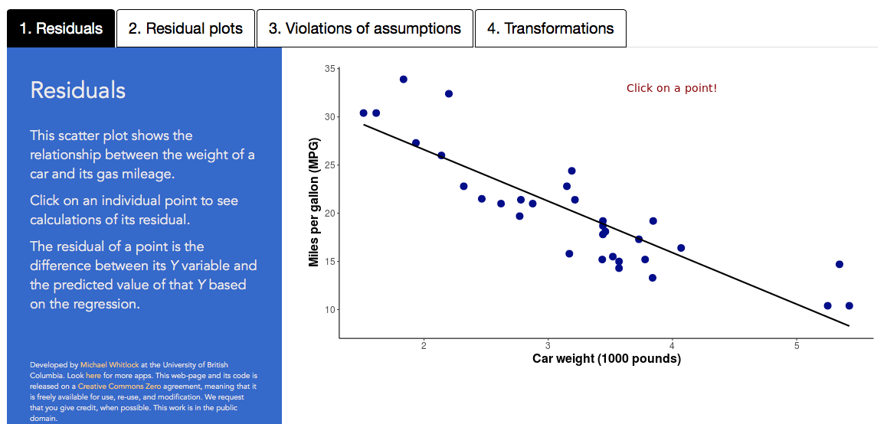

```{r setup, include=FALSE}
knitr::opts_chunk$set(echo = TRUE)
```

***

<br>

# Web visualizations

[A web visualization that understand residuals.](https://shiney.zoology.ubc.ca/whitlock/Residuals/). 

[](https://shiney.zoology.ubc.ca/whitlock/Residuals/)

<br>

# R lab

A lab on how to carry out regression in R, and related topics, is available [here](RLabs/R_tutorial_Correlation_Regression.html).

<br>

# Learn R by example

We used R to analyze all examples in chapter 17. We've put the code [here](RExamples/Rcode_Chapter_17.html) so that you can too.

<br> 

# Data

Download a .zip file with all the data for chapter 17 in .csv format [here](DataZipFiles/chapter17.zip). 

Download a .zip file with all data sets in the book [here](DataZipFiles/Data.zip). 

All data sets and their sources are listed individually below.

Disclaimer: Most data sets used in the book are grabbed from graphs and tables in the original publications, and the values may not be exact. Contact the original authors for the raw data.

<br> 

## Data for examples

[Example 17.1. Lion ages](Data/chapter17/chap17e1LionNoses.csv) 

Whitman, K., A. M. Starfield, H. S. Quadling and C. Packer. 2004. *Nature* 428: 175-178.  

[Example 17.3. Plant species and biomass](Data/chapter17/chap17e3PlantDiversityAndStability.csv) 

Tilman, D., P. B. Reich, and J. M. H. Knops. 2006. *Nature* 441: 629-632. 

[Figure 17.5-2. Junco outlier](Data/chapter17/chap17f5_2JuncoOutlier.csv) 

Yeh, P. J. 2004. *Evolution* 58: 166–174.

[Figure 17.5-3. Desert pool fish](Data/chapter17/chap17f5_3DesertPoolFish.csv) 

Kodric-Brown, A., and J. H. Brown. 1993. *Ecology* 74: 1847–1855.

[Figure 17.5-4 left. Cap color](Data/chapter17/chap17f5_4BlueTitCapColor.csv) 

Hadfield, J. D., et al. 2006. *Proceedings of the Royal Society of London, Series B, Biological Sciences* 273: 1347–1353.

[Figure 17.5-4 right. Cockroach neurons](Data/chapter17/chap17f5_4CockroachNeurons.csv) 

Murphy, B. F., Jr., and J. E. Heath. 1983. *Journal of Experimental Biology* 105: 305–315.

[Figure 17.6-3. Iris pollen](Data/chapter17/chap17f6_3IrisPollination.csv) 

Pauw, A., J. Stofberg, and R. J. Waterman. 2009. *Evolution* 63: 268-279.

[Figure 17.8-1. Iron and plankton](Data/chapter17/chap17f8_1IronAndPhytoplanktonGrowth.csv) 

Sunda, W. G., and Huntsman, S. A. 1997. *Nature* 390: 389–392.

[Figure 17.8-2. Plants and productivity](Data/chapter17/chap17f8_2PondPlantsAndProductivity.csv) 

Chase, J. M., and M. A. Leibold. 2002. *Nature* 416: 427-430.

[Example 17.8. Shrinking seals](Data/chapter17/chap17e8ShrinkingSeals.csv) 

Trites. A. W. 1996. *Journal of Zoology, London* 238: 459-482. 

[Figure 17.9-1. Guppy lethal temperature](Data/chapter17/chap17f9_1GuppyColdDeath.csv) 

Pitkow, R. B. 1060. *Biological Bulletin* 119: 231-245.

<br>

## Data for problem sets

[17.01. Faces and aggression](Data/chapter17/chap17q01FacesAndPenalties.csv) 

Carré, J. M., and C. M McCormick. 2008. *Proceedings of the Royal Society of London, Series B, Biological Sciences* 275: 2651–2656.

[17.06. Zoo mortality](Data/chapter17/chap17q06ZooMortality.csv) 

Clubb, R. and G. Mason. 2003. *Nature* 425: 473-474. 

[17.07. Exercise and progesterone](Data/chapter17/chap17q07ProgesteroneExercise.csv) 

Brutsaert, T. D., et al. 2002. *Journal of Experimental Biology* 205: 233-239. 

[17.10. Hybrid pollen sterility](Data/chapter17/chap17q10HybridPollenSterility.csv) 

Moyle, L. C., M. S. Olson, and P. Tiffin. 2004.  *Evolution* 58: 1195-1208. 

[17.11. Rattlensake digestion](Data/chapter17/chap17q11RattlesnakeDigestion.csv) 

Tattersall, G. J., et al. 2004. *Journal of Experimental Biology* 207: 579-585. 

[17.12. Lizard bites](Data/chapter17/chap17q12LizardBite.csv) 

Lappin, A. K., and J. F. Husak. 2005. *American Naturalist* 166: 426-436. 

[17.14. Hypoxanthine and time of death](Data/chapter17/chap17q14HypoxanthineTimeOfDeath.csv) 

James, R. A., P. A. Hoadley, and B. G. Sampson. 1997. *American Journal of Forensic Medicine and Pathology* 18: 158-162. 

[17.15. Social spiders](Data/chapter17/chap17q15SocialSpiderColonies.csv) 

Rypstra, A. L. 1979. *Behavioral Ecology and Sociobiology* 5: 291-300. 

[17.17. Earthworms and nitrogen](Data/chapter17/chap17q17EarthwormsAndNitrogen.csv) 

Gundale, M. J., W. M. Jolly, and T. H. Deluca. 2005. *Conservation Biology* 19: 1075-1083. 

[17.18. Cypress respiration](Data/chapter17/chap17q18CypressRespiration.csv) 

Reich, P. B., M. G. Tjoelker, J.-L. Machado, and J. Oleksyn. 2006. *Nature* 439: 457-461.

[17.19. Brothers and testes](Data/chapter17/chap17q19testesBrothers.csv) 

Fisher, H. S., K. A. Hook, W. D. Weber, and H. E. Hoekstra. 2018. *Ecology and Evolution* 8: 8197-8203.

[17.20. Grassland nutrients](Data/chapter17/chap17q20GrasslandNutrientsPlantSpecies.csv) 

Harpole, W. S. and D. Tilman. 2007. *Nature* 446: 791-793. 

[17.21. Primate metabolic rates](Data/chapter17/chap17q21PrimateMassMetabolicRate.csv) 

Heusner, A. A. 1991. Size and power in mammals. *Journal of Experimental Biology* 160: 25-54. 

[17.23. Flycatcher patch](Data/chapter17/chap17q23FlycatcherPatch.csv) 

Griffith, S. C. and B. C. Sheldon. 2001. *Animal Behaviour* 61: 987-993. 

[17.24. Connectivity and extinction](Data/chapter17/chap17q24Connectivity.csv) 

Jousimo, J.,  et al. 2014. *Science* 344:1289-1293.

[17.25. Penguin treadmill](Data/chapter17/chap17q25PenguinTreadmill.csv) 

Green, J. A., et al. 2001. *The Journal of Experimental Biology* 204: 673-684. 

[17.26. Beetle wings and horns](Data/chapter17/chap17q26BeetleWingsAndHorns.csv) 

Emlen, D. J. 2001. *Science* 291: 1534-1536. 

[17.27. Song of extinct katydid](Data/chapter17/chap17q27SongExtinctKatydid.csv) 

Gua, J.-J., et al. 2012. *Proceedings of the National Academy of Sciences (USA)* 109: 3868-3873.

[17.28. *Daphnia* parasites](Data/chapter17/chap17q28DaphniaParasiteLongevity.csv) 

Jensen, K. H., T. Little, A. Skorping, and D. Ebert. 2006. *PLoS Biology* 4: 1265-1269. 

[17.29. Grassland disease](Data/chapter17/chap17q29grasslandDisease.csv) 

Parker, I. M., et al. 2015. *Nature* 520: 542-544. 

[17.30. Mosquito bites](Data/chapter17/chap17q30DEETMosquiteBites.csv) 

Golenda, C. F., et al. 1999. *American Journal of Tropical Medicine and Hygiene* 60: 654-657. 

[17.31. Nuclear teeth](Data/chapter17/chap17q31NuclearTeeth.csv) 

Spalding, K. L.. et al. 2005. *Nature* 437: 333-334. 

[17.32. Last supper portion sizes](Data/chapter17/chap17q32LastSupperPortionSize.csv) 

Wansink, B., and C. S. Wansink. 2010. *International Journal of Obesity* 34: 943–944.

[17.33. Coral snake mimics](Data/chapter17/chap17q33CoralSnakeMimics.csv) 

Harper, G. R., Jr. and D. W. Pfennig. 2008. *Nature* 451: 1103-1106.

[17.34. Laying date and climate change](Data/chapter17/chap17q34EggLayingMismatch.csv) 

Reed T. E., et al. 2013. *Dryad Digital Repository*. doi:10.5061/dryad.8fc60

[17.35. Fathers age and mutations](Data/chapter17/chap17q35FatherAgeMutations.csv) 

Kong, A., et al. 2012. *Nature* 488: 471-475.

[17.36. Bees and climate change](Data/chapter17/chap17q36beeClimateChange.csv) 

Kerr, J. T. et al. 2015. *Science* 349:177-180.

